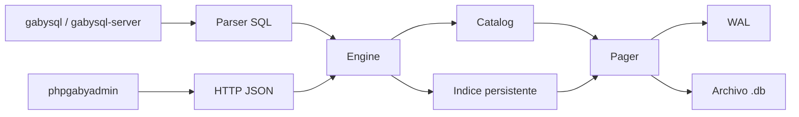

# 🏗️ ARCHITECTURE

> **Vista de alto nivel del motor, su flujo interno y las responsabilidades por módulo.**

---

## 🧭 Visión general

`gabysql` está dividido en capas simples y explícitas:
- CLI para trabajo local
- engine SQL para parsear y ejecutar
- catálogo para descubrir tablas
- índice persistente por PK
- pager + WAL para persistencia
- server HTTP para exponer la base
- `phpgabyadmin` como cliente web del API

## 🔄 Flujo principal

---

## 🖥️ Flujo por CLI

1. `gabysql exec` abre el `Pager`
2. inicia transacción
3. `parse()` divide y valida sentencias
4. `Engine` ejecuta cada `Statement`
5. si todo sale bien, `commit()` escribe WAL y aplica páginas
6. si algo falla, hace rollback

---

## 🌐 Flujo por HTTP

1. `gabysql-server` acepta la request
2. valida token si existe
3. abre la DB correspondiente
4. protege escritura con mutex cuando corresponde
5. ejecuta SQL o consulta catálogo/filas
6. serializa JSON y responde

---

## 🧩 Componentes

### `src/storage.rs`
Responsable de:
- crear (sin sobrescribir) y abrir archivos `.db`; expone `create_force` para reset explícito
- mantener el header del formato `VERSION=3`
- gestionar páginas (4096 bytes, los últimos 4 son trailer CRC32-IEEE)
- finalizar el checksum antes de cada flush y verificarlo al leer
- escribir WAL after-image, validar el CRC del payload de cada record y aplicar replay si hay marcador `COMMIT`

### `src/bptree.rs`
**B+Tree real con dos tipos de página:**
- `LEAF`: entradas `(key, value)` ordenadas, encadenadas por `next` para scans secuenciales eficientes.
- `INTERNAL`: `(first_child, [(key, child) ...])`. Lookup desciende por la rama correcta hasta llegar a una hoja.

Responsable de:
- almacenar pares `key -> value`
- inserción/upsert/delete por PK con splits en cascada
- mantener `root_page` estable cuando el root necesita splittear (técnica copy-up: el contenido del root se copia a una página nueva y el slot de root se reescribe como nuevo `INTERNAL`)
- recorrer rangos y full scans descendiendo al leftmost-leaf y siguiendo el chain `next`

### `src/catalog.rs`
Responsable de:
- registrar tablas usando hashing **FNV-1a-64** (estable entre versiones de Rust)
- leer schema y resolver páginas raíz de cada tabla
- validar `CREATE TABLE` (PK obligatoria, escalar `INT`)
- exponer `insert_row`, `upsert_row`, `delete_row`, `get_row`, `scan_rows`, `range_rows`

### `src/sql.rs`
Responsable de:
- tokenizar SQL
- parsear `CREATE`, `INSERT`, `SELECT`, `UPDATE`, `DELETE`
- validar tipos y filtros (todos los WHERE actuales son sobre la PK)
- serializar y deserializar filas
- ejecutar las sentencias contra el `Engine`: `UPDATE` re-codifica la fila completa y rechaza mutar la PK; `DELETE` retorna error si la PK no existe

### `src/server.rs`
Responsable de:
- exponer endpoints HTTP/JSON
- resolver single DB o multi DB
- aplicar autenticación por token
- limitar conexiones simultáneas (default 64, configurable con `-max-connections`); las que exceden el techo reciben `503`
- serializar resultados

### `web/phpgabyadmin/index.php`
Responsable de:
- consultar el API HTTP
- ejecutar SQL desde navegador
- listar DBs, tablas y filas
- importar CSV vía múltiples `INSERT`

---

## 🧠 Decisiones actuales

- Rust para el core del motor
- archivo único `.db` + `.wal` temporal
- SQL pequeño pero verificable
- server HTTP sin dependencias externas grandes
- admin web desacoplado del motor

---

## ⚖️ Trade-offs conscientes

- simplicidad por sobre throughput máximo
- claridad del storage por sobre feature breadth
- rango y full scan aceptables para tablas pequeñas o medianas
- seguridad básica suficiente para entorno controlado, no endurecimiento enterprise total

---

## 📈 Camino de evolución

Las mejoras naturales siguientes son:
- ~~`UPDATE` y `DELETE`~~ ✅ entregado (por PK)
- ~~checksums por página~~ ✅ entregado (CRC32-IEEE en trailer)
- ~~B+Tree multinivel real~~ ✅ entregado (LEAF + INTERNAL con root estable)
- comando `integrity_check` que recorra el B+Tree y revalide CRCs
- índices secundarios
- planner básico
- mejor locking entre procesos
- política formal de migración entre versiones del formato en disco
