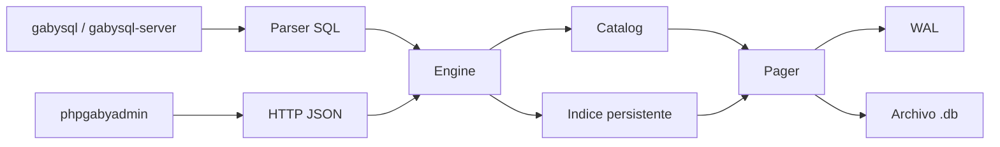

# 🏗️ ARCHITECTURE

> **Vista de alto nivel del motor, su flujo interno y las responsabilidades por módulo.**

---

## 🧭 Visión general

`gabysql` está dividido en capas simples y explícitas:
- CLI para trabajo local
- engine SQL para parsear y ejecutar
- catálogo para descubrir tablas
- índice persistente por PK
- pager + WAL para persistencia
- server HTTP para exponer la base
- `phpgabyadmin` como cliente web del API

## 🔄 Flujo principal

---

## 🖥️ Flujo por CLI

1. `gabysql exec` abre el `Pager`
2. inicia transacción
3. `parse()` divide y valida sentencias
4. `Engine` ejecuta cada `Statement`
5. si todo sale bien, `commit()` escribe WAL y aplica páginas
6. si algo falla, hace rollback

---

## 🌐 Flujo por HTTP

1. `gabysql-server` acepta la request
2. valida token si existe
3. abre la DB correspondiente
4. protege escritura con mutex cuando corresponde
5. ejecuta SQL o consulta catálogo/filas
6. serializa JSON y responde

---

## 🧩 Componentes

### `src/storage.rs`
Responsable de:
- crear y abrir archivos `.db`
- mantener header
- gestionar páginas
- escribir WAL y hacer recovery

### `src/bptree.rs`
Responsable de:
- almacenar pares `key -> value`
- insertar filas por PK
- leer por PK
- recorrer rangos y scans

### `src/catalog.rs`
Responsable de:
- registrar tablas
- leer schema
- validar `CREATE TABLE`
- resolver páginas raíz de cada tabla

### `src/sql.rs`
Responsable de:
- tokenizar SQL
- parsear sentencias soportadas
- validar tipos y filtros
- serializar y deserializar filas
- ejecutar `CREATE`, `INSERT`, `SELECT`

### `src/server.rs`
Responsable de:
- exponer endpoints HTTP/JSON
- resolver single DB o multi DB
- aplicar autenticación por token
- serializar resultados

### `web/phpgabyadmin/index.php`
Responsable de:
- consultar el API HTTP
- ejecutar SQL desde navegador
- listar DBs, tablas y filas
- importar CSV vía múltiples `INSERT`

---

## 🧠 Decisiones actuales

- Rust para el core del motor
- archivo único `.db` + `.wal` temporal
- SQL pequeño pero verificable
- server HTTP sin dependencias externas grandes
- admin web desacoplado del motor

---

## ⚖️ Trade-offs conscientes

- simplicidad por sobre throughput máximo
- claridad del storage por sobre feature breadth
- rango y full scan aceptables para tablas pequeñas o medianas
- seguridad básica suficiente para entorno controlado, no endurecimiento enterprise total

---

## 📈 Camino de evolución

Las mejoras naturales siguientes son:
- `UPDATE` y `DELETE`
- índices secundarios
- planner básico
- mejor locking
- versionado y migración del formato en disco
