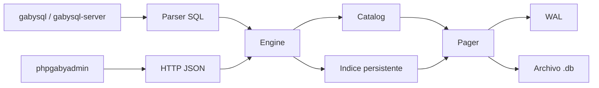

# 🏗️ ARCHITECTURE

> **Vista de alto nivel del motor, su flujo interno y las responsabilidades por módulo.**

---

## 🧭 Visión general

`gabysql` está dividido en capas simples y explícitas:
- CLI para trabajo local
- engine SQL para parsear y ejecutar
- catálogo para descubrir tablas
- índice persistente por PK
- pager + WAL para persistencia
- server HTTP para exponer la base
- `phpgabyadmin` como cliente web del API

## 🔄 Flujo principal

---

## 🖥️ Flujo por CLI

1. `gabysql exec` abre el `Pager`
2. inicia transacción
3. `parse()` divide y valida sentencias
4. `Engine` ejecuta cada `Statement`
5. si todo sale bien, `commit()` escribe WAL y aplica páginas
6. si algo falla, hace rollback

---

## 🌐 Flujo por HTTP

1. `gabysql-server` acepta la request
2. valida token si existe
3. abre la DB correspondiente
4. protege escritura con mutex cuando corresponde
5. ejecuta SQL o consulta catálogo/filas
6. serializa JSON y responde

---

## 🧩 Componentes

### `src/storage.rs`
Responsable de:
- crear (sin sobrescribir) y abrir archivos `.db`; expone `create_force` para reset explícito
- adquirir un **lock exclusivo cross-process** sobre el `.db` con `File::try_lock()` en cada `create/open`: dos procesos `gabysql` apuntando al mismo archivo → el segundo falla rápido con `database is locked by another process` (ver [ADR-0013](adr/0013-process-level-file-lock.md))
- mantener el header del formato `VERSION=7` (rechaza explícitamente versiones anteriores; ver [COMPATIBILITY.md](../COMPATIBILITY.md))
- gestionar páginas (4096 bytes, los últimos 4 son trailer CRC32-IEEE)
- finalizar el checksum antes de cada flush y verificarlo al leer
- escribir WAL after-image, validar el CRC del payload de cada record y aplicar replay si hay marcador `COMMIT`
- **`PageCache` con capacidad fija + LRU clean-only**: cap default `DEFAULT_CACHE_PAGES = 1024` (~4 MB con páginas de 4 KB); `Pager::set_cache_capacity(n)` para tunear. Las páginas dirty nunca se evictan (correctness > strict cap; drenan en commit). Ver [ADR-0009](adr/0009-page-cache-lru-bounded.md).

### `src/bptree.rs`
**B+Tree real con dos tipos de página:**
- `LEAF`: entradas `(key, value)` ordenadas, encadenadas por `next` para scans secuenciales eficientes.
- `INTERNAL`: `(first_child, [(key, child) ...])`. Lookup desciende por la rama correcta hasta llegar a una hoja.

Responsable de:
- almacenar pares `key -> value`
- inserción/upsert/delete por PK con splits en cascada
- mantener `root_page` estable cuando el root necesita splittear (técnica copy-up: el contenido del root se copia a una página nueva y el slot de root se reescribe como nuevo `INTERNAL`)
- recorrer rangos y full scans descendiendo al leftmost-leaf y siguiendo el chain `next`
- **`LeafCursor<'a>` lazy** que implementa `Iterator<Item = DbResult<KeyValue>>`: carga páginas leaf on-demand vía la chain `next` y short-circuita con `Iterator::take(n)`. Habilita `SELECT … LIMIT N` en O(N + offset) páginas leídas, no O(filas_totales). Ver [ADR-0008](adr/0008-leaf-cursor-iterator.md). Desde [ADR-0016](adr/0016-leafcursor-prefetch.md), `load_current` además warm-ea la siguiente hoja en `PageCache`.

### `src/catalog.rs`
Responsable de:
- registrar tablas usando hashing **FNV-1a-64** (estable entre versiones de Rust)
- leer schema y resolver páginas raíz de cada tabla
- validar `CREATE TABLE` (PK obligatoria, escalar `INT`; identificadores `[A-Za-z_][A-Za-z0-9_]*`, ≤ 64 chars, no reservados)
- persistir `Column { name, type, not_null, default?, references? }` con flags por bit (`0x01` NOT NULL, `0x02` HAS_DEFAULT, `0x04` HAS_FK) — VERSION 7
- persistir la lista de `IndexMeta { name, column, root_page, unique, kind }` en `TableMeta` (`kind: IndexKind = Hash | OrderedInt`, ADR-0017)
- persistir `ForeignKeyMeta { table, column, on_delete: RESTRICT|CASCADE }` por columna
- validar FK targets al DDL (target table existe o es self-ref, target column es la PK del target, tipos coinciden)
- exponer `insert_row`, `upsert_row`, `delete_row`, `get_row`, `scan_rows`, `range_rows`, `remove_table`

### `src/index.rs`
Responsable de los **índices secundarios**:
- `hash_value` (FNV-1a-64 fijado, distinto del catálogo solo por dominio de uso, mismo algoritmo)
- `encode_column_value` — representación canónica del valor (NULL = `[0]`, valor presente = `[1] + bytes_del_tipo`)
- codec del bucket: `[count:u16] + N × ([vlen:u16][value][pk:i64])`
- `bucket_insert / bucket_remove / bucket_lookup` con semántica idempotente para multivalor
- `bucket_unique_conflict` — usado por el path UNIQUE para detectar colisiones (NULL no colisiona)
- `validate_indexable` — rechaza columnas `JSON` (sin semántica canónica de igualdad)

### `src/sql.rs`
Responsable de:
- tokenizar SQL
- parsear `CREATE TABLE` (con constraints inline), `DROP TABLE`, `ALTER TABLE ADD COLUMN`, `INSERT`, `SELECT` (con `ORDER BY`), `UPDATE`, `DELETE`, `CREATE [UNIQUE] INDEX`, `DROP INDEX`, `INTEGRITY CHECK`
- validar tipos y filtros (`WHERE pk = ...`, `WHERE pk BETWEEN ...`, `WHERE col_indexada = ...`)
- serializar y deserializar filas (con tolerancia a EOF para columnas trailing ausentes — habilita `ALTER ADD COLUMN` sin reescritura)
- ejecutar las sentencias contra el `Engine`:
    - `INSERT` aplica DEFAULTs, valida NOT NULL, pre-check de UNIQUE y FK antes de tocar disco; mantiene índices secundarios.
    - `UPDATE` re-codifica la fila, valida NOT NULL/UNIQUE/FK sobre las columnas cambiadas, rechaza mutar la PK.
    - `DELETE` resuelve cascade/restrict (`delete_with_cascade` con worklist + visited set para cycles); mantiene índices.
    - `CREATE [UNIQUE] INDEX` hace backfill antes de publicar el índice; UNIQUE aborta en duplicados.
    - `INTEGRITY CHECK` barre páginas (CRC), filas (decode), entradas de índice (PK existe), FKs (parent existe).

### `src/server.rs`
Responsable de:
- exponer endpoints HTTP/JSON (incluido `GET /metrics` con `requests_total`, `requests_by_status`, `errors_total`, latencias p50/p95 y uptime; ver [ADR-0014](adr/0014-logs-json-metrics.md))
- emitir logs estructurados a stdout cuando se arranca con `-log-json` (una línea JSON por request: `{ts_unix, method, path, status, latency_ms}`)
- resolver single DB o multi DB
- aplicar autenticación por token
- limitar conexiones simultáneas (default 64, configurable con `-max-connections`); las que exceden el techo reciben `503`
- **interceptar `CREATE DATABASE` / `DROP DATABASE` / `SHOW DATABASES`** en `/exec` antes de abrir cualquier `Pager` (esos statements no operan sobre `TableMeta` sino sobre el directorio configurado con `-dir`); rechazar mezclarlos con sentencias de tabla en el mismo `/exec`
- serializar resultados

### `web/phpgabyadmin/index.php`
Responsable de:
- consultar el API HTTP
- ejecutar SQL desde navegador
- listar DBs, tablas y filas
- importar CSV vía múltiples `INSERT`

---

## 🧠 Decisiones actuales

- Rust para el core del motor
- archivo único `.db` + `.wal` temporal
- SQL pequeño pero verificable
- server HTTP sin dependencias externas grandes
- admin web desacoplado del motor

---

## ⚖️ Trade-offs conscientes

- simplicidad por sobre throughput máximo
- claridad del storage por sobre feature breadth
- rango y full scan aceptables para tablas pequeñas o medianas
- seguridad básica suficiente para entorno controlado, no endurecimiento enterprise total

---

## 📈 Camino de evolución

Las mejoras naturales siguientes son:
- ~~`UPDATE` y `DELETE`~~ ✅ entregado (por PK)
- ~~checksums por página~~ ✅ entregado (CRC32-IEEE en trailer)
- ~~B+Tree multinivel real~~ ✅ entregado (LEAF + INTERNAL con root estable)
- ~~índices secundarios (una columna, equality)~~ ✅ entregado
- ~~`NOT NULL` / `DEFAULT` / `UNIQUE` declarativos~~ ✅ entregado (VERSION 5)
- ~~`DROP TABLE` + `ALTER TABLE ADD COLUMN`~~ ✅ entregado
- ~~`FOREIGN KEY` declarativas + enforced (RESTRICT / CASCADE)~~ ✅ entregado (VERSION 6)
- ~~`INTEGRITY CHECK` operacional~~ ✅ entregado
- ~~`ORDER BY <col> [ASC|DESC]`~~ ✅ entregado
- ~~crash tests dirigidos (kill -9 entre WAL y file flush)~~ ✅ entregado
- ~~`LeafCursor` lazy iterator (SELECT LIMIT en O(N+offset))~~ ✅ entregado (ADR-0008)
- ~~`PageCache` LRU acotado (memoria del server bounded)~~ ✅ entregado (ADR-0009)
- ~~lock exclusivo cross-process del `.db`~~ ✅ entregado (ADR-0013)
- ~~logs JSON + endpoint `/metrics`~~ ✅ entregado (ADR-0014)
- ~~`backup`/`restore`/`verify` CLI con CRC end-to-end~~ ✅ entregado (ADR-0015)
- ~~prefetch en `LeafCursor` (warm-up de la próxima hoja)~~ ✅ entregado (ADR-0016)
- ~~índice INT-ordenado + range scan por índice (VERSION 7)~~ ✅ entregado (ADR-0017)
- ~~Subqueries (`IN (SELECT …)`, `= (SELECT …)` escalar, `[NOT] EXISTS` no-correlacionada/correlacionada single-eq)~~ ✅ entregado
- ~~`JOIN` (INNER, CROSS, comma-syntax, aliases, multi-tabla, self-join, LEFT/RIGHT/FULL [OUTER], USING, NATURAL, index-loop optimization)~~ ✅ entregado
- `Transaction` (Unit of Work) con cache de `TableMeta` — pendiente, ROI marginal hoy
- WAL persistente estilo SQLite-WAL — diseño documentado, sin código (ver [ADR-0018](adr/0018-wal-mode-opt-in.md)); condiciones de salida: bottleneck medido en gabybench, workload write-heavy real, o necesidad de MVCC
- índices compuestos
- range scan por índice secundario sobre `TEXT`/`FLOAT`/`DATE`/`DATETIME`
- planner cost-based real (hoy: deterministic dispatch + plan enum cerrado + index-loop join automático para INNER/LEFT con PK/índice)
- `GROUP BY`, window functions, CTE, vistas
- subqueries correlacionadas con múltiples predicados (`AND`/`OR` en `WHERE` interno) y derived tables (`FROM (SELECT ...) t`)
- política formal de migración entre versiones del formato en disco
