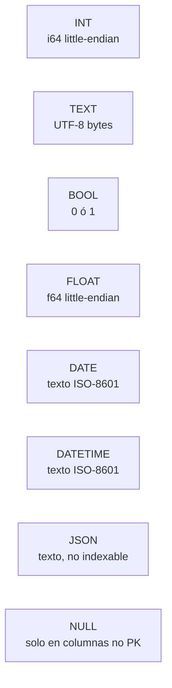
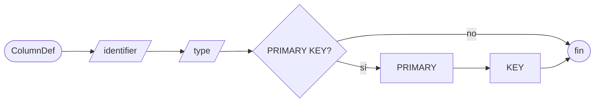
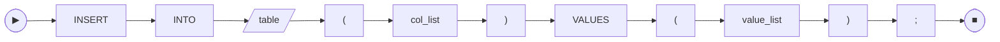
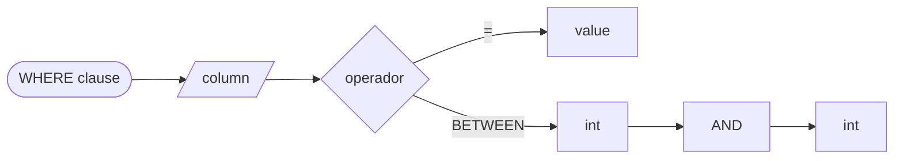
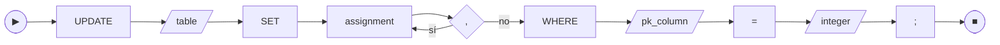
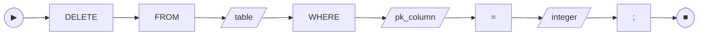

# 📐 Referencia SQL de `gabysql`

> **Esquema de cada comando soportado** con railroad diagram (mermaid), gramática EBNF, ejemplos válidos y errores típicos. Equivalente al *syntax diagrams* de SQLite o al *SQL command reference* de PostgreSQL — pero acotado al subset que `gabysql` ya entrega.
>
> Para el detalle del formato en disco que respalda esta gramática, ver [TECHNICAL_SPECS.md](TECHNICAL_SPECS.md). Para el AST en código, [src/sql.rs](../src/sql.rs).

---

## 🧭 Índice de comandos

| Comando | Categoría | Estado |
| :--- | :--- | :---: |
| [`CREATE TABLE`](#create-table) | DDL | 🟢 |
| [`CREATE INDEX`](#create-index) | DDL | 🟢 |
| [`DROP INDEX`](#drop-index) | DDL | 🟢 |
| [`INSERT`](#insert) | DML | 🟢 |
| [`SELECT`](#select) | DML | 🟢 |
| [`UPDATE`](#update) | DML | 🟢 |
| [`DELETE`](#delete) | DML | 🟢 |
| `ALTER TABLE`, `JOIN`, `ORDER BY`, `GROUP BY`, subqueries | — | 🔴 (ver [COMMERCIAL_ROADMAP](COMMERCIAL_ROADMAP.md)) |

---

## 🧱 Tipos de dato soportados



| Tipo | Almacenamiento | Indexable | Notas |
| :--- | :--- | :---: | :--- |
| `INT` | 8 bytes LE | ✅ | Único tipo válido como PK |
| `TEXT` | bytes UTF-8 | ✅ | Hasta 65 535 bytes por valor |
| `BOOL` | 1 byte | ✅ | `TRUE` / `FALSE` |
| `FLOAT` | 8 bytes LE (`f64`) | ✅ | Acepta literales enteros |
| `DATE` | texto | ✅ | Validación lexical, no semántica |
| `DATETIME` | texto | ✅ | Idem |
| `JSON` | texto | ❌ | Sin semántica de igualdad canónica |
| `NULL` | tag de presencia | n/a | No admitido en columnas PK |

---

## CREATE TABLE

### 🛤️ Railroad diagram




### 📜 EBNF

```
create_table  ::= "CREATE" "TABLE" identifier "(" column_def ("," column_def)* ")"
column_def    ::= identifier type ("PRIMARY" "KEY")?
type          ::= "INT" | "TEXT" | "BOOL" | "FLOAT" | "DATE" | "DATETIME" | "JSON"
identifier    ::= [A-Za-z_][A-Za-z0-9_]*
```

### ✅ Ejemplos válidos

```sql
CREATE TABLE users (
  id INT PRIMARY KEY,
  name TEXT,
  active BOOL,
  score FLOAT,
  born DATE,
  meta JSON
);

CREATE TABLE orders (id INT PRIMARY KEY, total FLOAT);
```

### ❌ Errores típicos

| Mensaje | Causa |
| :--- | :--- |
| `PRIMARY KEY 'pk' debe ser INT (...)` | la columna marcada como PK no es `INT` |
| `PRIMARY KEY requerida (...)` | no se declaró ninguna columna como PK |
| `nombre de columna duplicado` | dos columnas con el mismo nombre |
| `tabla X ya existe` | hay otra tabla con ese nombre en el catálogo |
| `tipo no soportado: BIGINT` | tipos fuera de la lista anterior |

---

## CREATE INDEX

### 🛤️ Railroad


### 📜 EBNF

```
create_index ::= "CREATE" "INDEX" identifier "ON" identifier "(" identifier ")"
```

### ✅ Ejemplos

```sql
-- Crear índice (backfill automático sobre las filas ya existentes)
CREATE INDEX idx_users_name ON users (name);
CREATE INDEX idx_orders_status ON orders (status);
```

### ❌ Errores típicos

| Mensaje | Causa |
| :--- | :--- |
| `ya existe un índice llamado 'X' en la tabla 'Y'` | el nombre del índice se repite (debe ser único en toda la DB) |
| `la columna 'X' ya tiene un índice secundario` | esta versión soporta solo un índice por columna |
| `no se admiten índices sobre columnas JSON en esta versión` | `JSON` no es indexable (ver tabla de tipos) |
| `columna no existe: X` | la columna no aparece en el `CREATE TABLE` |

> Reglas: una sola columna por índice, solo equality (`=`), sin `UNIQUE` declarativo. Ver [ADR-0005](adr/0005-secondary-index-bucket.md).

---

## DROP INDEX

### 🛤️ Railroad


### 📜 EBNF

```
drop_index ::= "DROP" "INDEX" identifier
```

### ✅ Ejemplos

```sql
DROP INDEX idx_users_name;
```

### ❌ Errores típicos

| Mensaje | Causa |
| :--- | :--- |
| `índice no existe: X` | no hay un índice con ese nombre en ninguna tabla |

> `DROP INDEX` no libera las páginas del B+Tree del índice. La reclamación queda para una futura herramienta `vacuum` (ver [STATUS.md](STATUS.md)).

---

## INSERT

### 🛤️ Railroad



### 📜 EBNF

```
insert      ::= "INSERT" "INTO" identifier "(" col_list ")" "VALUES" "(" value_list ")"
col_list    ::= identifier ("," identifier)*
value_list  ::= value ("," value)*
value       ::= integer | float | string | "TRUE" | "FALSE" | "NULL"
string      ::= "'" ([^'] | "''")* "'"
```

### ✅ Ejemplos

```sql
INSERT INTO users (id, name, active, score) VALUES (1, 'Ana', TRUE, 9.5);
INSERT INTO users (id, name, active) VALUES (2, 'Beto', FALSE);
INSERT INTO products (id, name, price) VALUES (10, 'Café o''rgánico', 4500.50);
```

### ❌ Errores típicos

| Mensaje | Causa |
| :--- | :--- |
| `cantidad columnas != valores` | la lista de columnas y la de valores tienen distinto largo |
| `columna duplicada en INSERT` | se nombra dos veces la misma columna |
| `columna no existe: X` | la columna no está en el schema |
| `duplicate primary key: N` | la PK ya está usada — usa otra o haz `UPDATE` |
| `PRIMARY KEY no puede ser NULL` | se intentó pasar `NULL` para la PK |
| `<col> debe ser INT` (o `FLOAT`, etc.) | tipo del valor no encaja con el de la columna |

> Mantenimiento: tras el insert, todos los índices secundarios de la tabla se actualizan automáticamente.

---

## SELECT

### 🛤️ Railroad




### 📜 EBNF

```
select       ::= "SELECT" select_cols "FROM" identifier
                  ("WHERE" where_clause)?
                  ("LIMIT" integer)?
                  ("OFFSET" integer)?
select_cols  ::= "*" | identifier ("," identifier)*
where_clause ::= identifier "=" value
               | identifier "BETWEEN" integer "AND" integer
```

> `=` funciona sobre la PK o sobre cualquier columna que tenga índice secundario. `BETWEEN` solo funciona sobre la PK (range scan secundario es parte del [Camino A](COMMERCIAL_ROADMAP.md)).

### ✅ Ejemplos

```sql
SELECT * FROM users;
SELECT id, name FROM users LIMIT 10;
SELECT id, name FROM users LIMIT 10 OFFSET 20;

-- Por PK
SELECT * FROM users WHERE id = 1;
SELECT id, name FROM users WHERE id BETWEEN 1 AND 100;

-- Por columna indexada (requiere CREATE INDEX previo)
SELECT * FROM users WHERE name = 'Ana';
SELECT id FROM orders WHERE status = 'pending' LIMIT 50;
```

### ❌ Errores típicos

| Mensaje | Causa |
| :--- | :--- |
| `tabla no existe: X` | la tabla no está creada en la DB |
| `WHERE solo soporta PK (X) o columnas con índice secundario; 'Y' no está indexada` | filtro sobre columna no-PK sin índice — créalo o usa la PK |
| `WHERE soporta solo '=' o BETWEEN` | operador no implementado (`<`, `>`, `LIKE`, etc.) |
| `PRIMARY KEY 'X' es INT; valor incompatible en WHERE` | pasaste un string a una PK INT |

---

## UPDATE

### 🛤️ Railroad




### 📜 EBNF

```
update       ::= "UPDATE" identifier "SET" assignment ("," assignment)*
                  "WHERE" identifier "=" integer
assignment   ::= identifier "=" value
```

### ✅ Ejemplos

```sql
UPDATE users SET name = 'Ana M' WHERE id = 1;

UPDATE orders
   SET status = 'paid', total = 199.50
 WHERE id = 42;
```

### ❌ Errores típicos

| Mensaje | Causa |
| :--- | :--- |
| `fila no existe: PK=N` | la PK del WHERE no está en la tabla — no es no-op silencioso |
| `no se permite cambiar la PRIMARY KEY en UPDATE (esta versión)` | se intentó `SET pk = ...` |
| `WHERE solo soporta PK (pk_name)` | filtro por columna no-PK |
| `columna duplicada en SET` | dos asignaciones a la misma columna |

> Solo los índices cuya columna está en el `SET` se tocan; los demás no pagan costo. Ver [src/sql.rs:exec_update](../src/sql.rs).

---

## DELETE

### 🛤️ Railroad



### 📜 EBNF

```
delete  ::= "DELETE" "FROM" identifier "WHERE" identifier "=" integer
```

### ✅ Ejemplos

```sql
DELETE FROM users WHERE id = 5;
```

### ❌ Errores típicos

| Mensaje | Causa |
| :--- | :--- |
| `fila no existe: PK=N` | PK inexistente — explícito, no silent no-op |
| `WHERE solo soporta PK (pk_name)` | no se admite `DELETE` por columna no-PK |

> Antes de borrar la fila, el engine la lee para evictar la entrada correspondiente de cada índice secundario.

---

## 🧠 Combinaciones útiles dentro de una transacción

`gabysql` permite múltiples sentencias separadas por `;` en un solo `/exec` HTTP o en un solo `gabysql exec ... "..."`. Todas viajan dentro de la misma transacción: si una falla, **todas** se revierten.

```sql
-- Receta común: schema + datos seed + índice + verify, todo atómico
CREATE TABLE products (id INT PRIMARY KEY, sku TEXT, price FLOAT);
INSERT INTO products (id, sku, price) VALUES (1, 'A-001', 99.0);
INSERT INTO products (id, sku, price) VALUES (2, 'A-002', 149.5);
CREATE INDEX idx_products_sku ON products (sku);
SELECT * FROM products WHERE sku = 'A-001';
```

Si la 4ª sentencia (`CREATE INDEX`) falla por el motivo que sea, las 3 anteriores también se revierten: la DB queda en el estado previo.

---

## 🔭 Lo que no está implementado todavía


Cada bucket vive en su camino correspondiente del [COMMERCIAL_ROADMAP](COMMERCIAL_ROADMAP.md). Si necesitas alguno con prioridad para un caso de uso real, abre un Issue describiendo el escenario.
