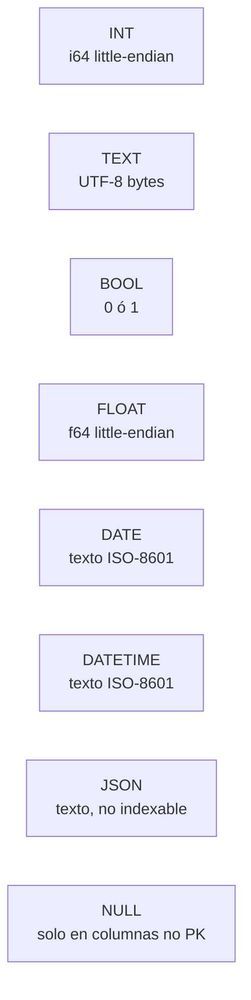
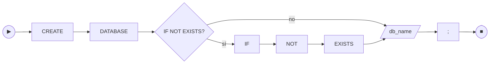
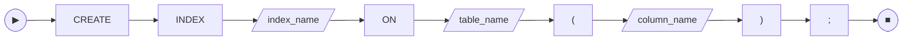
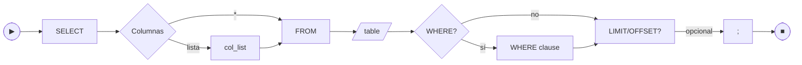
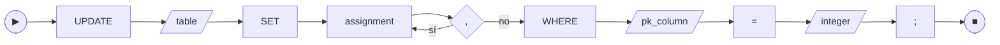
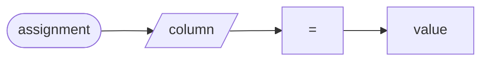
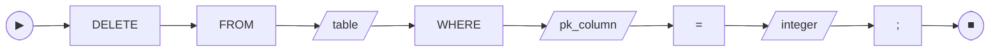
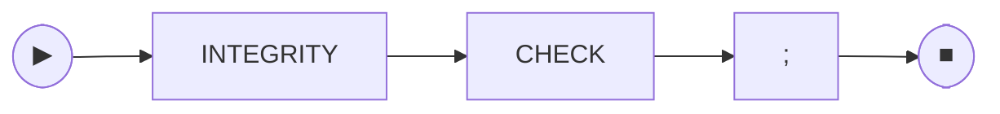
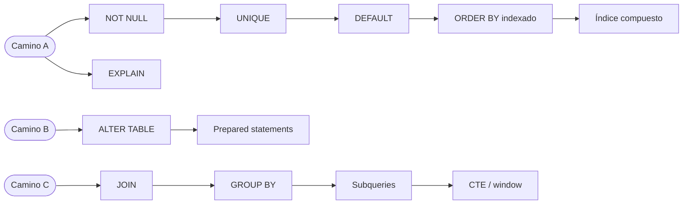

# 📐 Referencia SQL de `gabysql`

> **Esquema de cada comando soportado** con railroad diagram (mermaid), gramática EBNF, ejemplos válidos y errores típicos. Equivalente al *syntax diagrams* de SQLite o al *SQL command reference* de PostgreSQL — pero acotado al subset que `gabysql` ya entrega.
>
> Para el inventario **exhaustivo de lo que NO está implementado todavía** (comandos faltantes, prioridades, bloques de implementación sugeridos), ver [MISSING_COMMANDS.md](MISSING_COMMANDS.md).
>
> Para el detalle del formato en disco que respalda esta gramática, ver [TECHNICAL_SPECS.md](TECHNICAL_SPECS.md). Para el AST en código, [src/sql.rs](../src/sql.rs).

---

## 🧭 Índice de comandos

| Comando | Categoría | Estado |
| :--- | :--- | :---: |
| [`CREATE DATABASE`](#create-database) | DDL · server multi-DB | 🟢 |
| [`DROP DATABASE`](#drop-database) | DDL · server multi-DB | 🟢 |
| [`SHOW DATABASES`](#show-databases) | DDL · server multi-DB | 🟢 |
| [`INTEGRITY CHECK`](#integrity-check) | Operacional | 🟢 |
| [`CREATE TABLE`](#create-table) | DDL | 🟢 |
| [`DROP TABLE`](#drop-table) | DDL | 🟢 |
| [`ALTER TABLE ADD COLUMN`](#alter-table-add-column) | DDL | 🟢 |
| [`CREATE INDEX`](#create-index) | DDL | 🟢 |
| [`DROP INDEX`](#drop-index) | DDL | 🟢 |
| [`INSERT`](#insert) | DML | 🟢 |
| [`SELECT`](#select) | DML | 🟢 |
| [`UPDATE`](#update) | DML | 🟢 |
| [`DELETE`](#delete) | DML | 🟢 |
| `WHERE col IN (SELECT …)` (no-correlacionada, single-column) | DML | 🟢 |
| `WHERE col = (SELECT …)` (subquery escalar no-correlacionada) | DML | 🟢 |
| `WHERE [NOT] EXISTS (SELECT …)` (no-correlacionada y correlacionada single-eq) | DML | 🟢 |
| `WHERE` con `AND`/`OR`/`NOT` + paréntesis y 3VL para NULL (bloque E1) | DML | 🟢 |
| `INNER JOIN ... ON l = r`, `CROSS JOIN`, comma-syntax, aliases (`AS`), multi-tabla chain, self-join | DML | 🟢 |
| `LEFT [OUTER] JOIN`, `RIGHT [OUTER] JOIN`, `FULL [OUTER] JOIN` con NULL-fill | DML | 🟢 |
| `JOIN ... USING (col)`, `NATURAL JOIN` con SELECT * dedup | DML | 🟢 |
| Index-loop join optimization (transparente: aplica auto cuando hay índice/PK) | DML | 🟢 |
| `ALTER TABLE DROP/RENAME COLUMN`, `GROUP BY`, derived tables (`FROM (SELECT ...)`), correlated multi-predicate | — | 🔴 (ver [COMMERCIAL_ROADMAP](COMMERCIAL_ROADMAP.md)) |

---

## 🔤 Identificadores

Tablas, columnas e índices comparten una sola regla. Definida en [`catalog::validate_identifier`](../src/catalog.rs).

- Forma léxica: `[A-Za-z_][A-Za-z0-9_]*`
- Longitud máxima: **64** caracteres (`MAX_IDENT_LEN`)
- Case-insensitive en comparación, case-preserving en almacenamiento
- No puede ser una palabra reservada del parser

Palabras reservadas (case-insensitive): `add, alter, and, between, bool, column, create, database, databases, date, datetime, default, delete, drop, exists, false, float, from, if, index, insert, int, into, json, key, limit, not, null, offset, on, primary, select, set, show, table, text, true, unique, update, values, where`.

Errores típicos:

| Mensaje | Causa |
| :--- | :--- |
| `nombre de tabla 'X' es palabra reservada` | el nombre coincide con una keyword del parser |
| `nombre de columna 'X' inválido: debe empezar con letra o '_'` | empieza con dígito o símbolo |
| `nombre de índice 'X' inválido: solo se admiten [A-Za-z0-9_]` | tiene caracteres no permitidos (guion, espacio, etc.) |
| `nombre de tabla 'X' excede el máximo de 64 caracteres` | identificador demasiado largo |

---

## 🧱 Tipos de dato soportados



| Tipo | Almacenamiento | Indexable | Notas |
| :--- | :--- | :---: | :--- |
| `INT` | 8 bytes LE | ✅ | Único tipo válido como PK |
| `TEXT` | bytes UTF-8 | ✅ | Hasta 65 535 bytes por valor |
| `BOOL` | 1 byte | ✅ | `TRUE` / `FALSE` |
| `FLOAT` | 8 bytes LE (`f64`) | ✅ | Acepta literales enteros |
| `DATE` | texto | ✅ | Validación lexical, no semántica |
| `DATETIME` | texto | ✅ | Idem |
| `JSON` | texto | ❌ | Sin semántica de igualdad canónica |
| `NULL` | tag de presencia | n/a | No admitido en columnas PK |

---

## CREATE DATABASE

> **Solo en modo server multi-DB (`-dir`) o CLI con un directorio.** Crea un archivo `.db` aplicando el formato `VERSION = 7`. En modo single-DB (`-db`) responde `405`.

### 🛤️ Railroad



### 📜 EBNF

```
create_database ::= "CREATE" "DATABASE" ("IF" "NOT" "EXISTS")? identifier
```

### ✅ Ejemplos

```sql
CREATE DATABASE shop;
CREATE DATABASE IF NOT EXISTS analytics;
```

### ❌ Errores típicos

| Mensaje | Causa |
| :--- | :--- |
| `base de datos 'X' ya existe` | falta `IF NOT EXISTS` |
| `CREATE/DROP/SHOW DATABASE requieren modo -dir` | el server fue arrancado con `-db` |
| `nombre de DB inválido: solo [A-Za-z0-9_-]` | identificador con caracteres prohibidos |

---

## DROP DATABASE

> Elimina el archivo `.db` y su `.wal` si quedó. **Acción irreversible**, sin respaldo.

### 🛤️ Railroad


### 📜 EBNF

```
drop_database ::= "DROP" "DATABASE" ("IF" "EXISTS")? identifier
```

### ✅ Ejemplos

```sql
DROP DATABASE analytics;
DROP DATABASE IF EXISTS legacy;
```

### ❌ Errores típicos

| Mensaje | Causa |
| :--- | :--- |
| `base de datos 'X' no existe` | falta `IF EXISTS` y la DB no estaba |

---

## SHOW DATABASES

### 🛤️ Railroad


### 📜 EBNF

```
show_databases ::= "SHOW" "DATABASES"
```

### ✅ Resultado

Devuelve una `ResultSet` con una columna `database`, un row por DB ordenado alfabéticamente:

```json
{ "columns": ["database"], "rows": [["analytics"], ["shop"]], "message": null }
```

---

## CREATE TABLE

### 🛤️ Railroad diagram


### 📜 EBNF

```
create_table   ::= "CREATE" "TABLE" identifier "(" column_def ("," column_def)* ")"
column_def     ::= identifier type column_constraint*
column_constraint ::= "PRIMARY" "KEY"
                    | "NOT" "NULL"
                    | "UNIQUE"
                    | "DEFAULT" literal
                    | "REFERENCES" identifier "(" identifier ")" on_delete?
on_delete      ::= "ON" "DELETE" ("RESTRICT" | "CASCADE")
type           ::= "INT" | "TEXT" | "BOOL" | "FLOAT" | "DATE" | "DATETIME" | "JSON"
literal        ::= integer | float | string | "TRUE" | "FALSE" | "NULL"
identifier     ::= [A-Za-z_][A-Za-z0-9_]*
```

Notas:
- `PRIMARY KEY` implica `NOT NULL`. Sigue habiendo una sola PK por tabla y debe ser `INT`.
- `UNIQUE` inline auto-genera un índice unique con nombre `uq_<tabla>_<col>` (ver `CREATE UNIQUE INDEX`).
- `DEFAULT NULL` es válido pero incompatible con `NOT NULL` en la misma columna.
- `DEFAULT` no se admite sobre la PK.
- El literal de `DEFAULT` debe coincidir con el tipo de la columna; `name TEXT DEFAULT 1` se rechaza en `CREATE TABLE`.
- `REFERENCES <tabla>(<col>)`: el target column debe ser la PK del parent (no se admiten FKs contra `UNIQUE` no-PK en esta versión). El tipo de la FK debe coincidir con el de la PK referenciada (hoy ambos son siempre `INT`). Self-references (`employee.manager_id REFERENCES employee(id)`) son válidas. `ON DELETE` por default es `RESTRICT`.

### ✅ Ejemplos válidos

```sql
CREATE TABLE users (
  id INT PRIMARY KEY,
  email TEXT NOT NULL UNIQUE,
  name TEXT,
  active BOOL DEFAULT TRUE,
  score FLOAT,
  status TEXT NOT NULL DEFAULT 'pending',
  born DATE,
  meta JSON
);

CREATE TABLE orders (
  id INT PRIMARY KEY,
  user_id INT REFERENCES users(id) ON DELETE CASCADE,
  total FLOAT,
  tries INT DEFAULT 0
);

-- Self-reference: cada empleado puede tener un manager (que también es empleado).
CREATE TABLE employee (
  id INT PRIMARY KEY,
  name TEXT NOT NULL,
  manager_id INT REFERENCES employee(id)
);
```

### ❌ Errores típicos

| Mensaje | Causa |
| :--- | :--- |
| `PRIMARY KEY 'pk' debe ser INT (...)` | la columna marcada como PK no es `INT` |
| `PRIMARY KEY requerida (...)` | no se declaró ninguna columna como PK |
| `PRIMARY KEY 'pk' no admite DEFAULT en esta versión` | `DEFAULT` aplicado sobre la PK |
| `columna 'X': NOT NULL incompatible con DEFAULT NULL` | combinación contradictoria de constraints |
| `columna 'X': DEFAULT incompatible con tipo TEXT` | el literal de DEFAULT no coincide con el tipo declarado |
| `FOREIGN KEY 'X.col' referencia tabla inexistente 'Y'` | el target table no existe (ni es self-ref) |
| `FOREIGN KEY 'X.col' debe referenciar la PK de 'Y' (es 'pk_real'); esta versión no admite REFERENCES contra columnas no-PK` | target column no es la PK del parent |
| `FOREIGN KEY 'X.col' debe ser INT para coincidir con la PK de 'Y'` | tipo del FK no matchea el tipo de la PK referenciada |
| `nombre de columna duplicado` | dos columnas con el mismo nombre |
| `tabla X ya existe` | hay otra tabla con ese nombre en el catálogo |
| `tipo no soportado: BIGINT` | tipos fuera de la lista anterior |

---

## CREATE INDEX

### 🛤️ Railroad



### 📜 EBNF

```
create_index ::= "CREATE" "UNIQUE"? "INDEX" identifier "ON" identifier "(" identifier ")"
```

### ✅ Ejemplos

```sql
-- Crear índice (backfill automático sobre las filas ya existentes)
CREATE INDEX idx_users_name ON users (name);
CREATE INDEX idx_orders_status ON orders (status);

-- Índice único: el backfill aborta si existen duplicados; en caliente
-- INSERT/UPDATE conflictivos se rechazan antes de tocar disco.
CREATE UNIQUE INDEX uq_users_email ON users (email);
```

### ❌ Errores típicos

| Mensaje | Causa |
| :--- | :--- |
| `ya existe un índice llamado 'X' en la tabla 'Y'` | el nombre del índice se repite (debe ser único en toda la DB) |
| `la columna 'X' ya tiene un índice secundario` | esta versión soporta solo un índice por columna |
| `no se admiten índices sobre columnas JSON en esta versión` | `JSON` no es indexable (ver tabla de tipos) |
| `columna no existe: X` | la columna no aparece en el `CREATE TABLE` |
| `CREATE UNIQUE INDEX rechazado: columna 'X' tiene valores duplicados existentes` | la tabla ya tenía duplicados al pedir el índice unique |
| `violación de UNIQUE en índice 'uq_t_c' (PK existente: N)` | INSERT/UPDATE intenta colocar un valor ya presente en otra fila |

> Reglas: una sola columna por índice, solo equality (`=`). `UNIQUE` permite múltiples `NULL`. Ver [ADR-0005](adr/0005-secondary-index-bucket.md).

---

## DROP INDEX

### 🛤️ Railroad


### 📜 EBNF

```
drop_index ::= "DROP" "INDEX" identifier
```

### ✅ Ejemplos

```sql
DROP INDEX idx_users_name;
```

### ❌ Errores típicos

| Mensaje | Causa |
| :--- | :--- |
| `índice no existe: X` | no hay un índice con ese nombre en ninguna tabla |

> `DROP INDEX` no libera las páginas del B+Tree del índice. La reclamación queda para una futura herramienta `vacuum` (ver [STATUS.md](STATUS.md)).

---

## DROP TABLE

> Borra la entrada de la tabla en el catálogo. Las páginas backing (data + índices secundarios de esa tabla) **no** se liberan; el espacio se reclama con un futuro `vacuum`.

### 🛤️ Railroad


### 📜 EBNF

```
drop_table ::= "DROP" "TABLE" ("IF" "EXISTS")? identifier
```

### ✅ Ejemplos

```sql
DROP TABLE users;
DROP TABLE IF EXISTS scratch;
```

### ❌ Errores típicos

| Mensaje | Causa |
| :--- | :--- |
| `tabla no existe: X` | no hay tabla con ese nombre y no se usó `IF EXISTS` |

---

## ALTER TABLE ADD COLUMN

> Agrega una columna **al final** del esquema. Las filas previas se decodifican con su `DEFAULT` (o `NULL`) sin reescritura — el rewrite ocurre naturalmente cuando un `UPDATE` toca esa fila.

### 🛤️ Railroad


### 📜 EBNF

```
alter_table_add ::= "ALTER" "TABLE" identifier "ADD" "COLUMN"? column_def
column_def       ::= identifier type column_constraint*
```

### ✅ Ejemplos

```sql
ALTER TABLE users ADD COLUMN nick TEXT;
ALTER TABLE users ADD COLUMN status TEXT NOT NULL DEFAULT 'pending';
ALTER TABLE users ADD COLUMN email TEXT UNIQUE;
ALTER TABLE users ADD score FLOAT DEFAULT 0;     -- COLUMN es opcional
```

### ❌ Errores típicos

| Mensaje | Causa |
| :--- | :--- |
| `tabla no existe: X` | la tabla a alterar no está en el catálogo |
| `columna 'X' ya existe en la tabla 'Y'` | nombre repetido |
| `ALTER TABLE ADD COLUMN no admite PRIMARY KEY (la PK ya existe)` | esta versión no permite swap ni multi-PK |
| `ALTER TABLE ADD COLUMN 'X' NOT NULL requiere un DEFAULT no nulo (...)` | sin DEFAULT, las filas previas violarían la constraint |
| `ALTER TABLE ADD COLUMN 'X' UNIQUE con DEFAULT no nulo produciría duplicados en N filas existentes` | el backfill insertaría el mismo valor en todas las filas |
| `columna 'X': DEFAULT incompatible con tipo TEXT` | mismo validador de tipos que `CREATE TABLE` |

> Restricciones: solo `ADD`. No hay `DROP COLUMN`, `RENAME COLUMN`, `RENAME TABLE` ni `ALTER ... TYPE` en esta versión — están en el roadmap del [Camino A](COMMERCIAL_ROADMAP.md).

---

## INSERT

### 🛤️ Railroad


### 📜 EBNF

```
insert      ::= "INSERT" "INTO" identifier "(" col_list ")" "VALUES" "(" value_list ")"
col_list    ::= identifier ("," identifier)*
value_list  ::= value ("," value)*
value       ::= integer | float | string | "TRUE" | "FALSE" | "NULL"
string      ::= "'" ([^'] | "''")* "'"
```

### ✅ Ejemplos

```sql
INSERT INTO users (id, name, active, score) VALUES (1, 'Ana', TRUE, 9.5);
INSERT INTO users (id, name, active) VALUES (2, 'Beto', FALSE);
INSERT INTO products (id, name, price) VALUES (10, 'Café o''rgánico', 4500.50);
```

### ❌ Errores típicos

| Mensaje | Causa |
| :--- | :--- |
| `cantidad columnas != valores` | la lista de columnas y la de valores tienen distinto largo |
| `columna duplicada en INSERT` | se nombra dos veces la misma columna |
| `columna no existe: X` | la columna no está en el schema |
| `duplicate primary key: N` | la PK ya está usada — usa otra o haz `UPDATE` |
| `PRIMARY KEY no puede ser NULL` | se intentó pasar `NULL` para la PK |
| `<col> debe ser INT` (o `FLOAT`, etc.) | tipo del valor no encaja con el de la columna |

> Mantenimiento: tras el insert, todos los índices secundarios de la tabla se actualizan automáticamente.

---

## SELECT

### 🛤️ Railroad



```mermaid
flowchart LR
    A([WHERE clause]) --> COL[/column/]
    COL --> EQ{operador}
    EQ -- "=" --> V1[value | "(" SELECT subquery ")"]
    EQ -- "BETWEEN" --> V2[int] --> AND[AND] --> V3[int]
    EQ -- "IN" --> LP["("] --> SUB[SELECT subquery] --> RP[")"]
```

### 📜 EBNF

```
select       ::= "SELECT" select_cols "FROM" identifier
                  ("WHERE" where_clause)?
                  ("ORDER" "BY" identifier ("ASC" | "DESC")?)?
                  ("LIMIT" integer)?
                  ("OFFSET" integer)?
select_cols  ::= "*" | identifier ("," identifier)*
where_clause  ::= where_or
where_or      ::= where_and ( "OR" where_and )*
where_and     ::= where_not ( "AND" where_not )*
where_not     ::= "NOT" where_not
                | where_primary
where_primary ::= "(" where_or ")"
                | "EXISTS" "(" select ")"
                | "NOT" "EXISTS" "(" select ")"
                | where_atom
where_atom    ::= identifier "=" ( value | "(" select ")" | qualified_ident )
                | identifier "BETWEEN" integer "AND" integer
                | identifier "IN" "(" select ")"
qualified_ident ::= identifier ( "." identifier )?
```

**Precedencia** (de más baja a más alta): `OR` < `AND` < `NOT` < paréntesis / átomo.
Es la convención estándar SQL: `a OR b AND c` se interpreta como `a OR (b AND c)`.
Los paréntesis fuerzan agrupaciones distintas.

**Lógica trivaluada (3VL)** — el WHERE evalúa con la tabla de verdad de SQL
estándar para NULL:

- `NULL AND false` → `false`; `NULL AND true` → `NULL`; `NULL AND NULL` → `NULL`
- `NULL OR true`  → `true`;  `NULL OR false` → `NULL`; `NULL OR NULL` → `NULL`
- `NOT NULL` → `NULL`
- Una fila sobrevive el filtro solo si la expresión evalúa a `true`;
  `false` y `NULL` (unknown) la descartan.

**Limitación E1**: `EXISTS` correlacionado y `col = otra.col` (column-ref del
outer) **solo se permiten como único átomo del WHERE**. Combinarlos con
`AND`/`OR`/`NOT` devuelve `[GBY-4024]` — soporte completo queda para un
bloque posterior. Subqueries no-correlacionadas (`IN (SELECT)`, `= (SELECT)`,
`EXISTS` no-correlacionado) sí se pueden combinar libremente.

### 🔗 FROM con JOINs (bloque A del roadmap)

```
from_clause ::= table_ref join_clause*
table_ref   ::= identifier [ ["AS"] identifier ]
join_clause ::= ( "," | "CROSS" "JOIN" ) table_ref
              | ( "INNER" "JOIN" | "JOIN" ) table_ref "ON" qualified_ident "=" qualified_ident
              | ( "LEFT"  ["OUTER"] "JOIN" ) table_ref "ON" qualified_ident "=" qualified_ident
              | ( "RIGHT" ["OUTER"] "JOIN" ) table_ref "ON" qualified_ident "=" qualified_ident
              | ( "FULL"  ["OUTER"] "JOIN" ) table_ref "ON" qualified_ident "=" qualified_ident
              | ( "INNER" | "LEFT" ["OUTER"] | "RIGHT" ["OUTER"] | "FULL" ["OUTER"] | ε ) "JOIN" table_ref "USING" "(" identifier ")"
              | "NATURAL" ( "INNER" | "LEFT" ["OUTER"] | "RIGHT" ["OUTER"] | "FULL" ["OUTER"] | ε ) "JOIN" table_ref
```

**Reglas:**
- `INNER JOIN` (o `JOIN` solo, equivalente ANSI) requiere `ON l = r` con un único equi-predicado (`AND`/`OR` y operadores no-equi quedan para el bloque D).
- `CROSS JOIN` (y la comma-syntax `FROM a, b`) NO admite `ON`. Producto cartesiano completo.
- `LEFT [OUTER] JOIN`: preserva todas las filas del lado izquierdo. Cuando no hay match, las columnas del lado derecho aparecen como `NULL`.
- `RIGHT [OUTER] JOIN`: simétrico — preserva todas las del derecho, NULL-fill en el izquierdo.
- `FULL [OUTER] JOIN`: combina ambos comportamientos (toda fila de cualquier lado aparece, con NULL en el otro lado si no hay match).
- El `OUTER` es opcional (estándar SQL): `LEFT JOIN` y `LEFT OUTER JOIN` son sinónimos.
- `JOIN ... USING (col)` es sugar para `JOIN ... ON l.col = r.col`. La columna `col` aparece **una sola vez** en `SELECT *` (ANSI). En este release soporta exactamente UNA columna en la lista (multi-col en backlog).
- `NATURAL JOIN` deriva automáticamente un `USING` con la columna que ambas tablas comparten por nombre. Si las tablas comparten 0 o >1 columnas comunes en este release → `[GBY-4023]`.
- Las tablas se pueden aliasar con `[AS] alias`. El alias **oculta** el nombre real (estándar SQL): si declarás `FROM alumnos a`, después tenés que usar `a.nombre`, no `alumnos.nombre`.
- En SELECT/WHERE/ORDER BY, una columna que existe en >1 tabla **debe** ir cualificada (`tabla.col`); si no, `[GBY-4018]`.
- `SELECT *` en JOIN expande a TODAS las columnas de TODAS las tablas, cada una prefijada con su qualifier para evitar colisiones.

**Complejidad:**
- **Nested-loop puro** (fallback): `O(N1 × N2 × … × Nk)`. Se usa cuando el `ON` no apunta contra PK ni índice del right, o cuando el JOIN es CROSS/RIGHT/FULL.
- **Index-loop** (optimización transparente): `O(N1 × log N2)` por JOIN. Se activa automáticamente cuando se cumplen las 3 condiciones: (a) el `ON` (o el USING/NATURAL derivado) referencia la PK o una columna indexada del right; (b) el `JoinKind` es `INNER` o `LEFT`; (c) hay un predicate (no aplica a `CROSS`). El engine elige el path por sí mismo — no hace falta cambiar el SQL.

> **Sobre `qualified_ident` en el RHS del `=`:** solo es válido **dentro de una subquery correlacionada** dentro de `EXISTS (...)`. Permite expresar `WHERE inner_col = outer_table.outer_col`, donde `outer_table` es la tabla del SELECT padre. Usarlo fuera de ese contexto devuelve `[GBY-4016]`.
>
> **Sobre `EXISTS`:** la subquery se ejecuta una sola vez si **no** referencia columnas del outer; cuando sí lo hace, se re-ejecuta una vez por cada fila del outer (post-filter). Esta variante correlacionada es O(N × costo_subquery), sin optimizer; tiene sentido cuando la subquery se reduce vía PK/índice con la outer-ref.

> `=` funciona sobre la PK o sobre cualquier columna que tenga índice secundario. `BETWEEN` funciona sobre la PK y sobre cualquier columna `INT` con índice secundario (índice `OrderedInt`, default automático al crear índice sobre `INT`; ver [ADR-0017](adr/0017-int-ordered-index-version-7.md)); para `TEXT`/`FLOAT`/`BOOL`/`DATE`/`DATETIME` indexados, `BETWEEN` queda en el [Camino A](COMMERCIAL_ROADMAP.md). `IN (SELECT …)` acepta subqueries **no-correlacionadas** (la subquery no referencia columnas del outer); la subquery debe devolver exactamente una columna, se ejecuta una sola vez y el resultado se materializa como set para filtrar el outer — la columna del outer debe ser la PK o tener índice secundario, igual que `=`. `ORDER BY` funciona sobre cualquier columna del schema (no requiere índice); el sort es en memoria post-scan, así que para tablas grandes con `LIMIT` chico conviene tener un `WHERE` que reduzca el conjunto antes del sort.

### ✅ Ejemplos

```sql
SELECT * FROM users;
SELECT id, name FROM users LIMIT 10;
SELECT id, name FROM users LIMIT 10 OFFSET 20;

-- Por PK
SELECT * FROM users WHERE id = 1;
SELECT id, name FROM users WHERE id BETWEEN 1 AND 100;

-- Por columna indexada (requiere CREATE INDEX previo)
SELECT * FROM users WHERE name = 'Ana';
SELECT id FROM orders WHERE status = 'pending' LIMIT 50;

-- BETWEEN sobre columna INT indexada (índice OrderedInt, ADR-0017)
-- CREATE INDEX idx_users_score ON users (score);  -- score INT
SELECT id, name FROM users WHERE score BETWEEN 80 AND 100 LIMIT 25;

-- AND / OR / NOT + paréntesis (bloque E1)
SELECT id FROM users WHERE active = TRUE AND score BETWEEN 80 AND 100;
SELECT id FROM users WHERE city = 'BA' OR city = 'MDQ';
SELECT id FROM users WHERE NOT status = 'banned';
SELECT id FROM users WHERE (city = 'BA' OR city = 'MDQ') AND active = TRUE;
-- Precedencia estándar: AND ata más fuerte que OR.
SELECT id FROM users WHERE city = 'BA' OR city = 'MDQ' AND active = TRUE;
-- Equivale a: city = 'BA' OR (city = 'MDQ' AND active = TRUE)

-- ORDER BY (cualquier columna; ASC default; NULLs primero)
SELECT id, name FROM users ORDER BY name ASC;
SELECT id, name FROM users ORDER BY score DESC LIMIT 10;
SELECT id FROM orders WHERE status = 'pending' ORDER BY total DESC LIMIT 5 OFFSET 10;

-- IN (SELECT …) — subquery no-correlacionada
-- Requiere: outer.curso_id indexado (o ser PK) e inner.nivel indexado (o ser PK).
SELECT nombre FROM alumnos
 WHERE curso_id IN (SELECT id FROM cursos WHERE nivel = '3 Medio');

-- IN sobre PK directa (no requiere índice en el outer):
SELECT id, label FROM t WHERE id IN (SELECT ref_id FROM picks);

-- = (SELECT …) — subquery escalar (1 columna × ≤1 fila).
-- Si la subquery devuelve 0 filas o NULL, el match es vacío (semántica ANSI).
-- Si devuelve >1 fila, error [GBY-4014] — usar IN (...) en su lugar.
SELECT nombre FROM alumnos
 WHERE curso_id = (SELECT id FROM cursos WHERE nombre = 'matematica');

-- EXISTS no-correlacionada: la subquery se ejecuta UNA vez.
SELECT id FROM padre WHERE EXISTS (SELECT id FROM auditoria WHERE id = 1);

-- EXISTS correlacionada: re-ejecuta por cada fila del outer.
-- Padres que tienen al menos un hijo:
SELECT id, nombre FROM padre
 WHERE EXISTS (SELECT id FROM hijo WHERE parent_id = padre.id);

-- NOT EXISTS correlacionado: padres sin hijos.
SELECT id, nombre FROM padre
 WHERE NOT EXISTS (SELECT id FROM hijo WHERE parent_id = padre.id);

-- INNER JOIN clásico con aliases y columnas cualificadas
SELECT a.nombre, c.nombre FROM alumnos a
 INNER JOIN cursos c ON a.curso_id = c.id
 ORDER BY a.nombre ASC;

-- JOIN de 3 tablas en cadena (left-deep)
SELECT persona.nombre, ciudad.nombre, pais.nombre
  FROM persona
  JOIN ciudad ON persona.ciudad_id = ciudad.id
  JOIN pais   ON ciudad.pais_id = pais.id;

-- CROSS JOIN explícito (cartesian product)
SELECT a.v, b.w FROM a CROSS JOIN b;

-- Comma-syntax = CROSS JOIN
SELECT a.v, b.w FROM a, b;

-- Self-join vía aliases distintos
SELECT e.nombre, j.nombre FROM empleado e
  INNER JOIN empleado j ON e.jefe_id = j.id;

-- WHERE sobre columna cualificada de cualquier tabla
SELECT alumnos.nombre FROM alumnos
  JOIN cursos ON alumnos.curso_id = cursos.id
 WHERE cursos.nivel = '3M';

-- LEFT JOIN: padres sin hijos aparecen con etiqueta NULL
SELECT padre.nombre, hijo.etiqueta FROM padre
  LEFT JOIN hijo ON padre.id = hijo.parent_id
 ORDER BY padre.id ASC;

-- RIGHT JOIN: filas del derecho sin match aparecen con columnas del izq en NULL
SELECT a.v, b.w FROM a
  RIGHT JOIN b ON a.id = b.a_id;

-- FULL OUTER JOIN: combina LEFT + RIGHT en un solo paso
SELECT a.v, b.w FROM a
  FULL OUTER JOIN b ON a.id = b.a_id;

-- USING (col) — sugar para ON l.col = r.col; SELECT * dedup la columna
SELECT ciudad.nombre, pais.nombre_pais
  FROM ciudad JOIN pais USING (pais_id);

-- NATURAL JOIN — auto-detecta la columna común por nombre
SELECT ciudad.nombre, pais.nombre_pais
  FROM ciudad NATURAL JOIN pais;
```

### ❌ Errores típicos

| Mensaje | Causa |
| :--- | :--- |
| `tabla no existe: X` | la tabla no está creada en la DB |
| `ORDER BY: columna 'X' no existe en 'Y'` | la columna del ORDER BY no está en el schema de la tabla |
| `WHERE solo soporta PK (X) o columnas con índice secundario; 'Y' no está indexada` | filtro sobre columna no-PK sin índice — créalo o usa la PK |
| `WHERE soporta solo '=', BETWEEN o IN (SELECT ...)` | operador no implementado (`<`, `>`, `LIKE`, `IN (lista, literal)`, etc.) |
| `subquery en IN debe devolver exactamente 1 columna; devolvió N` | la subquery proyectó más de una columna — reescribila con una sola |
| `subquery escalar debe devolver exactamente 1 columna; devolvió N` | igual que el anterior pero en `= (SELECT ...)` |
| `subquery escalar en WHERE devolvió N filas; debe devolver a lo sumo 1` | la subquery escalar matcheó más de una fila — agregar `WHERE`/`LIMIT 1` o usar `IN (SELECT ...)` |
| `WHERE IN solo soporta PK (X) o columnas con índice secundario; 'Y' no está indexada` | la columna del outer en `IN (...)` o `= (SELECT ...)` no es PK ni tiene `CREATE INDEX` |
| `EXISTS requiere '(SELECT ...)' a continuación` `[GBY-4015]` | `EXISTS` no seguido por un paréntesis abriendo un `SELECT` |
| `outer column 'X.Y' fuera de alcance` `[GBY-4016]` | `col = outer.col` usado fuera de un `EXISTS (...)` correlacionado, o la tabla outer no coincide con la del outer-stack |
| `PRIMARY KEY 'X' es INT; valor incompatible en WHERE` | pasaste un string a una PK INT |

---

## UPDATE

### 🛤️ Railroad





### 📜 EBNF

```
update       ::= "UPDATE" identifier "SET" assignment ("," assignment)*
                  "WHERE" identifier "=" integer
assignment   ::= identifier "=" value
```

### ✅ Ejemplos

```sql
UPDATE users SET name = 'Ana M' WHERE id = 1;

UPDATE orders
   SET status = 'paid', total = 199.50
 WHERE id = 42;
```

### ❌ Errores típicos

| Mensaje | Causa |
| :--- | :--- |
| `fila no existe: PK=N` | la PK del WHERE no está en la tabla — no es no-op silencioso |
| `no se permite cambiar la PRIMARY KEY en UPDATE (esta versión)` | se intentó `SET pk = ...` |
| `WHERE solo soporta PK (pk_name)` | filtro por columna no-PK |
| `columna duplicada en SET` | dos asignaciones a la misma columna |

> Solo los índices cuya columna está en el `SET` se tocan; los demás no pagan costo. Ver [src/sql.rs:exec_update](../src/sql.rs).

---

## DELETE

### 🛤️ Railroad



### 📜 EBNF

```
delete  ::= "DELETE" "FROM" identifier "WHERE" identifier "=" integer
```

### ✅ Ejemplos

```sql
DELETE FROM users WHERE id = 5;
```

### ❌ Errores típicos

| Mensaje | Causa |
| :--- | :--- |
| `fila no existe: PK=N` | PK inexistente — explícito, no silent no-op |
| `WHERE solo soporta PK (pk_name)` | no se admite `DELETE` por columna no-PK |
| `violación de FK: 'X.col' referencia 'Y' (ON DELETE RESTRICT, N fila(s) afectadas)` | hay filas hijas y la FK fue declarada `ON DELETE RESTRICT` (default) |

> Antes de borrar la fila, el engine la lee para evictar la entrada correspondiente de cada índice secundario. Si la tabla tiene FKs entrantes, el motor resuelve cascade/restrict iterativamente con un worklist y cycle protection (visited set sobre `(tabla, pk)`). Para tablas grandes con FKs entrantes, **se recomienda crear un índice secundario sobre la columna FK del hijo** — el engine lo usa automáticamente para que el lookup de hijos sea O(log n) en vez de full scan.

---

## INTEGRITY CHECK

> Recorre la DB abierta y reporta toda inconsistencia detectable: páginas con CRC inválido, filas no decodificables, entradas de índice secundario huérfanas (apuntan a PKs que ya no existen) y FKs huérfanas (valor no NULL sin parent). De solo lectura — no modifica nada.

### 🛤️ Railroad



### 📜 EBNF

```
integrity_check ::= "INTEGRITY" "CHECK"
```

### ✅ Forma del resultado

`INTEGRITY CHECK` devuelve un ResultSet con columnas `kind`, `object`, `detail` — una fila por hallazgo. El campo `message` resume:

- DB sana: `OK · N tablas · M filas · K índices · F FKs · P páginas`
- DB con hallazgos: `FAIL · H hallazgos · ...`

Ejemplo de respuesta sin hallazgos:
```json
{
  "columns": ["kind", "object", "detail"],
  "rows": [],
  "message": "OK · 2 tablas · 4 filas · 1 índices · 2 FKs · 4 páginas"
}
```

### 🏷️ Categorías de hallazgo

| `kind` | Significado |
| :--- | :--- |
| `page_corrupt` | El pager rechazó la página al cargarla (CRC mismatch o lectura corta). |
| `row_decode` | Los bytes de la fila no se ajustan al esquema actual de la tabla. Muy raro — solo ocurre si el encoder y el decoder se desincronizan. |
| `orphan_index_entry` | Una entrada de un índice secundario apunta a una PK que ya no existe en la tabla. |
| `fk_target_missing` | Una columna declara `REFERENCES` contra una tabla que ya no existe. |
| `fk_orphan` | Un valor no nulo de una columna FK no tiene parent en la tabla referenciada. |

> Recomendado correrlo después de un crash, después de restaurar un backup, o como sanity check periódico. La complejidad es O(filas + entradas_de_índice + filas_con_FK), totalmente secuencial.

---

## 🧠 Combinaciones útiles dentro de una transacción

`gabysql` permite múltiples sentencias separadas por `;` en un solo `/exec` HTTP o en un solo `gabysql exec ... "..."`. Todas viajan dentro de la misma transacción: si una falla, **todas** se revierten.

```sql
-- Receta común: schema + datos seed + índice + verify, todo atómico
CREATE TABLE products (id INT PRIMARY KEY, sku TEXT, price FLOAT);
INSERT INTO products (id, sku, price) VALUES (1, 'A-001', 99.0);
INSERT INTO products (id, sku, price) VALUES (2, 'A-002', 149.5);
CREATE INDEX idx_products_sku ON products (sku);
SELECT * FROM products WHERE sku = 'A-001';
```

Si la 4ª sentencia (`CREATE INDEX`) falla por el motivo que sea, las 3 anteriores también se revierten: la DB queda en el estado previo.

---

## 🔭 Lo que no está implementado todavía



Cada bucket vive en su camino correspondiente del [COMMERCIAL_ROADMAP](COMMERCIAL_ROADMAP.md). Si necesitas alguno con prioridad para un caso de uso real, abre un Issue describiendo el escenario.
