# 📐 Referencia SQL de `gabysql`

> **Esquema de cada comando soportado** con railroad diagram (mermaid), gramática EBNF, ejemplos válidos y errores típicos. Equivalente al *syntax diagrams* de SQLite o al *SQL command reference* de PostgreSQL — pero acotado al subset que `gabysql` ya entrega.
>
> Para el inventario **exhaustivo de lo que NO está implementado todavía** (comandos faltantes, prioridades, bloques de implementación sugeridos), ver [MISSING_COMMANDS.md](MISSING_COMMANDS.md).
>
> Para el detalle del formato en disco que respalda esta gramática, ver [TECHNICAL_SPECS.md](TECHNICAL_SPECS.md). Para el AST en código, [src/sql.rs](../src/sql.rs).

---

## 🧭 Índice de comandos

| Comando | Categoría | Estado |
| :--- | :--- | :---: |
| [`CREATE DATABASE`](#create-database) | DDL · server multi-DB | 🟢 |
| [`DROP DATABASE`](#drop-database) | DDL · server multi-DB | 🟢 |
| [`SHOW DATABASES`](#show-databases) | DDL · server multi-DB | 🟢 |
| [`INTEGRITY CHECK`](#integrity-check) | Operacional | 🟢 |
| [`CREATE TABLE`](#create-table) | DDL | 🟢 |
| [`DROP TABLE`](#drop-table) | DDL | 🟢 |
| [`ALTER TABLE ADD COLUMN`](#alter-table-add-column) | DDL | 🟢 |
| [`CREATE TABLE AS SELECT` / `RENAME TABLE` / `ALTER TABLE DROP/RENAME COLUMN`](#ddl-extendido-k1) | DDL (K1) | 🟢 |
| [`CREATE INDEX`](#create-index) | DDL | 🟢 |
| [`DROP INDEX`](#drop-index) | DDL | 🟢 |
| [`INSERT`](#insert) | DML | 🟢 |
| [`SELECT`](#select) | DML | 🟢 |
| [`UPDATE`](#update) (WHERE completo desde bloque E3 — multi-fila, indexado, subquery) | DML | 🟢 |
| [`DELETE`](#delete) (WHERE completo desde bloque E3 — multi-fila, indexado, subquery) | DML | 🟢 |
| `WHERE col IN (SELECT …)` (no-correlacionada, single-column) | DML | 🟢 |
| `WHERE col = (SELECT …)` (subquery escalar no-correlacionada) | DML | 🟢 |
| `WHERE [NOT] EXISTS (SELECT …)` (no-correlacionada y correlacionada single-eq) | DML | 🟢 |
| `WHERE` con `AND`/`OR`/`NOT` + paréntesis y 3VL para NULL (bloque E1) | DML | 🟢 |
| `WHERE` con `<`, `>`, `<=`, `>=`, `<>`/`!=`, `[NOT] LIKE` (con `%`/`_`), `IS [NOT] NULL`, `[NOT] IN (lista)` (bloque E2) | DML | 🟢 |
| Agregaciones: `COUNT(*)`, `COUNT(col)`, `COUNT(DISTINCT col)`, `SUM`, `AVG`, `MIN`, `MAX`, `GROUP BY`, `HAVING`, `DISTINCT` (bloque F) | DML | 🟢 (sin JOINs aún) |
| Transacciones explícitas: `BEGIN`/`START TRANSACTION`, `COMMIT`/`END`, `ROLLBACK` (bloque T) | TCL | 🟢 (batch-local; `SAVEPOINT` y cross-request pendientes) |
| Multi-row `INSERT` `VALUES (...), (...)`, `INSERT INTO t SELECT ...`, `TRUNCATE [TABLE]` (bloque J) | DML | 🟢 |
| `UPSERT` (`INSERT ... ON CONFLICT DO NOTHING / DO UPDATE SET ...`), `REPLACE INTO`, `RETURNING` (bloque J2) | DML | 🟢 (sin `EXCLUDED.col`) |
| `INNER JOIN ... ON l = r`, `CROSS JOIN`, comma-syntax, aliases (`AS`), multi-tabla chain, self-join | DML | 🟢 |
| `LEFT [OUTER] JOIN`, `RIGHT [OUTER] JOIN`, `FULL [OUTER] JOIN` con NULL-fill | DML | 🟢 |
| `JOIN ... USING (col)`, `NATURAL JOIN` con SELECT * dedup | DML | 🟢 |
| Index-loop join optimization (transparente: aplica auto cuando hay índice/PK) | DML | 🟢 |
| PK compuesta (`PRIMARY KEY (a, b, ...)`) — all-INT NOT NULL | DDL | 🟢 (K2, VERSION 8) |
| Índices compuestos (`CREATE [UNIQUE] INDEX idx ON t (a, b, ...)`) — all-INT, equality-only | DDL | 🟢 (K2, VERSION 8) |
| Partial indexes, `ALTER COLUMN TYPE`, ALTER PK, FK multi-col, window functions, CTE | — | 🔴 (ver [MISSING_COMMANDS](MISSING_COMMANDS.md) y [COMMERCIAL_ROADMAP](COMMERCIAL_ROADMAP.md)) |

---

## 🔤 Identificadores

Tablas, columnas e índices comparten una sola regla. Definida en [`catalog::validate_identifier`](../src/catalog.rs).

- Forma léxica: `[A-Za-z_][A-Za-z0-9_]*`
- Longitud máxima: **64** caracteres (`MAX_IDENT_LEN`)
- Case-insensitive en comparación, case-preserving en almacenamiento
- No puede ser una palabra reservada del parser

Palabras reservadas (case-insensitive): `add, alter, and, between, bool, column, create, database, databases, date, datetime, default, delete, drop, exists, false, float, from, if, index, insert, int, into, json, key, limit, not, null, offset, on, primary, select, set, show, table, text, true, unique, update, values, where`.

Errores típicos:

| Mensaje | Causa |
| :--- | :--- |
| `nombre de tabla 'X' es palabra reservada` | el nombre coincide con una keyword del parser |
| `nombre de columna 'X' inválido: debe empezar con letra o '_'` | empieza con dígito o símbolo |
| `nombre de índice 'X' inválido: solo se admiten [A-Za-z0-9_]` | tiene caracteres no permitidos (guion, espacio, etc.) |
| `nombre de tabla 'X' excede el máximo de 64 caracteres` | identificador demasiado largo |

---

## 🧱 Tipos de dato soportados

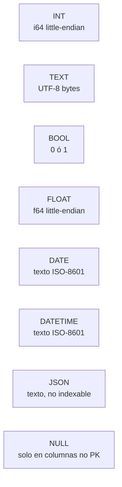

| Tipo | Almacenamiento | Indexable | Notas |
| :--- | :--- | :---: | :--- |
| `INT` | 8 bytes LE | ✅ | Único tipo válido como PK |
| `TEXT` | bytes UTF-8 | ✅ | Hasta 65 535 bytes por valor |
| `BOOL` | 1 byte | ✅ | `TRUE` / `FALSE` |
| `FLOAT` | 8 bytes LE (`f64`) | ✅ | Acepta literales enteros |
| `DATE` | texto | ✅ | Validación lexical, no semántica |
| `DATETIME` | texto | ✅ | Idem |
| `JSON` | texto | ❌ | Sin semántica de igualdad canónica |
| `NULL` | tag de presencia | n/a | No admitido en columnas PK |

---

## CREATE DATABASE

> **Solo en modo server multi-DB (`-dir`) o CLI con un directorio.** Crea un archivo `.db` aplicando el formato `VERSION = 7`. En modo single-DB (`-db`) responde `405`.

### 🛤️ Railroad


### 📜 EBNF

```
create_database ::= "CREATE" "DATABASE" ("IF" "NOT" "EXISTS")? identifier
```

### ✅ Ejemplos

```sql
CREATE DATABASE shop;
CREATE DATABASE IF NOT EXISTS analytics;
```

### ❌ Errores típicos

| Mensaje | Causa |
| :--- | :--- |
| `base de datos 'X' ya existe` | falta `IF NOT EXISTS` |
| `CREATE/DROP/SHOW DATABASE requieren modo -dir` | el server fue arrancado con `-db` |
| `nombre de DB inválido: solo [A-Za-z0-9_-]` | identificador con caracteres prohibidos |

---

## DROP DATABASE

> Elimina el archivo `.db` y su `.wal` si quedó. **Acción irreversible**, sin respaldo.

### 🛤️ Railroad

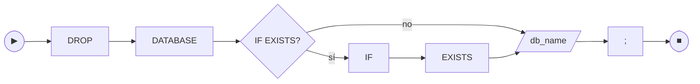

### 📜 EBNF

```
drop_database ::= "DROP" "DATABASE" ("IF" "EXISTS")? identifier
```

### ✅ Ejemplos

```sql
DROP DATABASE analytics;
DROP DATABASE IF EXISTS legacy;
```

### ❌ Errores típicos

| Mensaje | Causa |
| :--- | :--- |
| `base de datos 'X' no existe` | falta `IF EXISTS` y la DB no estaba |

---

## SHOW DATABASES

### 🛤️ Railroad

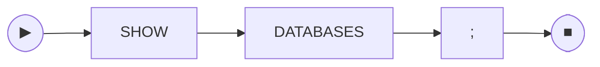

### 📜 EBNF

```
show_databases ::= "SHOW" "DATABASES"
```

### ✅ Resultado

Devuelve una `ResultSet` con una columna `database`, un row por DB ordenado alfabéticamente:

```json
{ "columns": ["database"], "rows": [["analytics"], ["shop"]], "message": null }
```

---

## CREATE TABLE

### 🛤️ Railroad diagram

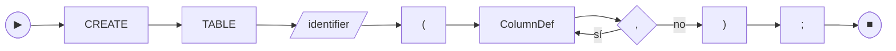

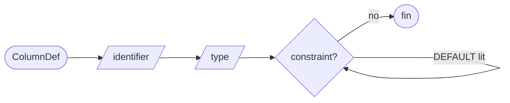

### 📜 EBNF

```
create_table   ::= "CREATE" "TABLE" identifier "(" column_def ("," column_def)* ")"
column_def     ::= identifier type column_constraint*
column_constraint ::= "PRIMARY" "KEY"
                    | "NOT" "NULL"
                    | "UNIQUE"
                    | "DEFAULT" literal
                    | "REFERENCES" identifier "(" identifier ")" on_delete?
on_delete      ::= "ON" "DELETE" ("RESTRICT" | "CASCADE")
type           ::= "INT" | "TEXT" | "BOOL" | "FLOAT" | "DATE" | "DATETIME" | "JSON"
literal        ::= integer | float | string | "TRUE" | "FALSE" | "NULL"
identifier     ::= [A-Za-z_][A-Za-z0-9_]*
```

Notas:
- `PRIMARY KEY` implica `NOT NULL`. Sigue habiendo una sola PK por tabla y debe ser `INT`.
- `UNIQUE` inline auto-genera un índice unique con nombre `uq_<tabla>_<col>` (ver `CREATE UNIQUE INDEX`).
- `DEFAULT NULL` es válido pero incompatible con `NOT NULL` en la misma columna.
- `DEFAULT` no se admite sobre la PK.
- El literal de `DEFAULT` debe coincidir con el tipo de la columna; `name TEXT DEFAULT 1` se rechaza en `CREATE TABLE`.
- `REFERENCES <tabla>(<col>)`: el target column debe ser la PK del parent (no se admiten FKs contra `UNIQUE` no-PK en esta versión). El tipo de la FK debe coincidir con el de la PK referenciada (hoy ambos son siempre `INT`). Self-references (`employee.manager_id REFERENCES employee(id)`) son válidas. `ON DELETE` por default es `RESTRICT`.

### ✅ Ejemplos válidos

```sql
CREATE TABLE users (
  id INT PRIMARY KEY,
  email TEXT NOT NULL UNIQUE,
  name TEXT,
  active BOOL DEFAULT TRUE,
  score FLOAT,
  status TEXT NOT NULL DEFAULT 'pending',
  born DATE,
  meta JSON
);

CREATE TABLE orders (
  id INT PRIMARY KEY,
  user_id INT REFERENCES users(id) ON DELETE CASCADE,
  total FLOAT,
  tries INT DEFAULT 0
);

-- Self-reference: cada empleado puede tener un manager (que también es empleado).
CREATE TABLE employee (
  id INT PRIMARY KEY,
  name TEXT NOT NULL,
  manager_id INT REFERENCES employee(id)
);
```

### ❌ Errores típicos

| Mensaje | Causa |
| :--- | :--- |
| `PRIMARY KEY 'pk' debe ser INT (...)` | la columna marcada como PK no es `INT` |
| `PRIMARY KEY requerida (...)` | no se declaró ninguna columna como PK |
| `PRIMARY KEY 'pk' no admite DEFAULT en esta versión` | `DEFAULT` aplicado sobre la PK |
| `columna 'X': NOT NULL incompatible con DEFAULT NULL` | combinación contradictoria de constraints |
| `columna 'X': DEFAULT incompatible con tipo TEXT` | el literal de DEFAULT no coincide con el tipo declarado |
| `FOREIGN KEY 'X.col' referencia tabla inexistente 'Y'` | el target table no existe (ni es self-ref) |
| `FOREIGN KEY 'X.col' debe referenciar la PK de 'Y' (es 'pk_real'); esta versión no admite REFERENCES contra columnas no-PK` | target column no es la PK del parent |
| `FOREIGN KEY 'X.col' debe ser INT para coincidir con la PK de 'Y'` | tipo del FK no matchea el tipo de la PK referenciada |
| `nombre de columna duplicado` | dos columnas con el mismo nombre |
| `tabla X ya existe` | hay otra tabla con ese nombre en el catálogo |
| `tipo no soportado: BIGINT` | tipos fuera de la lista anterior |

---

## CREATE INDEX

### 🛤️ Railroad


### 📜 EBNF

```
create_index ::= "CREATE" "UNIQUE"? "INDEX" identifier "ON" identifier "(" identifier ")"
```

### ✅ Ejemplos

```sql
-- Crear índice (backfill automático sobre las filas ya existentes)
CREATE INDEX idx_users_name ON users (name);
CREATE INDEX idx_orders_status ON orders (status);

-- Índice único: el backfill aborta si existen duplicados; en caliente
-- INSERT/UPDATE conflictivos se rechazan antes de tocar disco.
CREATE UNIQUE INDEX uq_users_email ON users (email);
```

### ❌ Errores típicos

| Mensaje | Causa |
| :--- | :--- |
| `ya existe un índice llamado 'X' en la tabla 'Y'` | el nombre del índice se repite (debe ser único en toda la DB) |
| `la columna 'X' ya tiene un índice secundario` | esta versión soporta solo un índice por columna |
| `no se admiten índices sobre columnas JSON en esta versión` | `JSON` no es indexable (ver tabla de tipos) |
| `columna no existe: X` | la columna no aparece en el `CREATE TABLE` |
| `CREATE UNIQUE INDEX rechazado: columna 'X' tiene valores duplicados existentes` | la tabla ya tenía duplicados al pedir el índice unique |
| `violación de UNIQUE en índice 'uq_t_c' (PK existente: N)` | INSERT/UPDATE intenta colocar un valor ya presente en otra fila |

> Reglas: una sola columna por índice, solo equality (`=`). `UNIQUE` permite múltiples `NULL`. Ver [ADR-0005](adr/0005-secondary-index-bucket.md).

---

## DROP INDEX

### 🛤️ Railroad

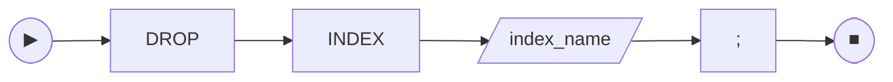

### 📜 EBNF

```
drop_index ::= "DROP" "INDEX" identifier
```

### ✅ Ejemplos

```sql
DROP INDEX idx_users_name;
```

### ❌ Errores típicos

| Mensaje | Causa |
| :--- | :--- |
| `índice no existe: X` | no hay un índice con ese nombre en ninguna tabla |

> `DROP INDEX` no libera las páginas del B+Tree del índice. La reclamación queda para una futura herramienta `vacuum` (ver [STATUS.md](STATUS.md)).

---

## DROP TABLE

> Borra la entrada de la tabla en el catálogo. Las páginas backing (data + índices secundarios de esa tabla) **no** se liberan; el espacio se reclama con un futuro `vacuum`.

### 🛤️ Railroad

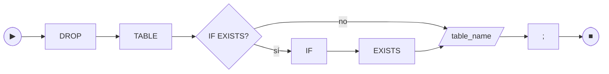

### 📜 EBNF

```
drop_table ::= "DROP" "TABLE" ("IF" "EXISTS")? identifier
```

### ✅ Ejemplos

```sql
DROP TABLE users;
DROP TABLE IF EXISTS scratch;
```

### ❌ Errores típicos

| Mensaje | Causa |
| :--- | :--- |
| `tabla no existe: X` | no hay tabla con ese nombre y no se usó `IF EXISTS` |

---

## ALTER TABLE ADD COLUMN

> Agrega una columna **al final** del esquema. Las filas previas se decodifican con su `DEFAULT` (o `NULL`) sin reescritura — el rewrite ocurre naturalmente cuando un `UPDATE` toca esa fila.

### 🛤️ Railroad

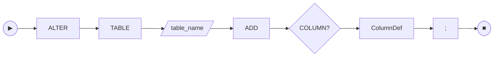

### 📜 EBNF

```
alter_table_add ::= "ALTER" "TABLE" identifier "ADD" "COLUMN"? column_def
column_def       ::= identifier type column_constraint*
```

### ✅ Ejemplos

```sql
ALTER TABLE users ADD COLUMN nick TEXT;
ALTER TABLE users ADD COLUMN status TEXT NOT NULL DEFAULT 'pending';
ALTER TABLE users ADD COLUMN email TEXT UNIQUE;
ALTER TABLE users ADD score FLOAT DEFAULT 0;     -- COLUMN es opcional
```

### ❌ Errores típicos

| Mensaje | Causa |
| :--- | :--- |
| `tabla no existe: X` | la tabla a alterar no está en el catálogo |
| `columna 'X' ya existe en la tabla 'Y'` | nombre repetido |
| `ALTER TABLE ADD COLUMN no admite PRIMARY KEY (la PK ya existe)` | esta versión no permite swap ni multi-PK |
| `ALTER TABLE ADD COLUMN 'X' NOT NULL requiere un DEFAULT no nulo (...)` | sin DEFAULT, las filas previas violarían la constraint |
| `ALTER TABLE ADD COLUMN 'X' UNIQUE con DEFAULT no nulo produciría duplicados en N filas existentes` | el backfill insertaría el mismo valor en todas las filas |
| `columna 'X': DEFAULT incompatible con tipo TEXT` | mismo validador de tipos que `CREATE TABLE` |

> Restricciones: para `DROP COLUMN`, `RENAME COLUMN` y `RENAME TABLE` ver la sección [DDL extendido (K1)](#ddl-extendido-k1). PK compuesta + índices compuestos cerrados en K2 (VERSION 8, ver ADR-0019). `ALTER ... TYPE` y ALTER PK siguen pendientes.

---

## DDL extendido (K1)

> Bloque K1 (2026-05-26). Cuatro sentencias DDL adicionales que **no** cambian el formato en disco (VERSION sigue en 7).

### `CREATE TABLE [IF NOT EXISTS] [(col_aliases)] AS SELECT`

Materializa el resultado de una `SelectQuery` (SELECT, set ops o VALUES) como una tabla nueva. La primera columna del result-set debe ser INT no-NULL y se promueve a `PRIMARY KEY`.

```
ctas ::= "CREATE" "TABLE" ("IF" "NOT" "EXISTS")? identifier
         ("(" identifier ("," identifier)* ")")?
         "AS" select_query ";"
```

```sql
CREATE TABLE activos AS SELECT id, nombre FROM usuarios WHERE id > 0;
CREATE TABLE IF NOT EXISTS dst (pk, label) AS SELECT id, nombre FROM src;
CREATE TABLE lit (id, label) AS VALUES (1, 'a'), (2, 'b');
CREATE TABLE merged AS SELECT id, nombre FROM a UNION SELECT id, nombre FROM b;
```

Errores típicos: `[GBY-4058]` primera columna no INT no-NULL · `[GBY-4063]` arity de aliases ≠ arity del SELECT · `[GBY-2004]` el destino ya existe (sin `IF NOT EXISTS`).

### `RENAME TABLE` / `ALTER TABLE ... RENAME TO`

```
rename_table ::= "RENAME" "TABLE" identifier "TO" identifier ";"
              |  "ALTER" "TABLE" identifier "RENAME" "TO" identifier ";"
```

```sql
RENAME TABLE old TO new;
ALTER TABLE old RENAME TO new;
```

Las FKs entrantes (otras tablas que referencien `old`) se reescriben automáticamente al nuevo nombre. Errores: `[GBY-4062]` destino tomado · `[GBY-2001]` origen no existe.

### `ALTER TABLE ... DROP COLUMN [IF EXISTS]`

```
alter_drop ::= "ALTER" "TABLE" identifier "DROP" "COLUMN"
               ("IF" "EXISTS")? identifier ";"
```

```sql
ALTER TABLE users DROP COLUMN nick;
ALTER TABLE users DROP COLUMN IF EXISTS deprecated_flag;
```

Bloqueado sobre la PK (`[GBY-4059]`), columnas indexadas (`[GBY-4060]`, sugiere `DROP INDEX <name>` primero) y columnas con FK saliente o entrante (`[GBY-4061]`). Implementación: rewrite in place de cada fila (`decode` + `remove` + `encode` + `upsert`).

### `ALTER TABLE ... RENAME COLUMN`

```
alter_rename_col ::= "ALTER" "TABLE" identifier "RENAME" "COLUMN"
                     identifier "TO" identifier ";"
```

```sql
ALTER TABLE users RENAME COLUMN nick TO handle;
ALTER TABLE pedidos RENAME COLUMN id TO pedido_id;  -- arrastra PK + FKs entrantes
```

No reescribe filas (el on-disk row es posicional). Si la columna es la PK, `TableMeta.primary_key` se actualiza; si está indexada, `IndexMeta.column` se actualiza; las FKs entrantes que referencien la columna se reescriben. Errores: `[GBY-4062]` destino tomado · `[GBY-2002]` origen no existe.

---

## INSERT

### 🛤️ Railroad

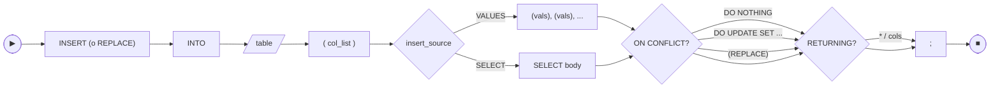

### 📜 EBNF

```
insert        ::= ("INSERT" | "REPLACE") "INTO" identifier "(" col_list ")"
                  insert_source
                  on_conflict_clause?
                  returning_clause?
insert_source ::= "VALUES" "(" value_list ")" ("," "(" value_list ")")*
                | "SELECT" select_body
on_conflict_clause
              ::= "ON" "CONFLICT" ( "(" identifier ")" )? "DO" conflict_action
conflict_action
              ::= "NOTHING"
                | "UPDATE" "SET" assignment ("," assignment)*
assignment    ::= identifier "=" value
returning_clause
              ::= "RETURNING" ( "*" | identifier ("," identifier)* )
col_list      ::= identifier ("," identifier)*
value_list    ::= value ("," value)*
value         ::= integer | float | string | "TRUE" | "FALSE" | "NULL"
string        ::= "'" ([^'] | "''")* "'"
```

`REPLACE INTO ... VALUES (...)` se desugara internamente a
`INSERT ... ON CONFLICT DO REPLACE` — la cláusula `ON CONFLICT` explícita
no se acepta si la sentencia empezó con `REPLACE`. El target opcional
`(col)` solo se admite si `col` es PK o tiene índice UNIQUE (`[GBY-4032]`).
En `DO UPDATE SET`, los valores de la derecha son literales — `EXCLUDED.col`
no se soporta en este release.

Desde el bloque **J** (2026-05-25) el `INSERT` admite tres formas:
- Single-row: `INSERT INTO t (cols) VALUES (a, b, c);`
- Multi-row: `INSERT INTO t (cols) VALUES (a, b), (c, d), (e, f);`
- Por subquery: `INSERT INTO t (cols) SELECT ... FROM ...;` — el `SELECT` puede usar cualquier feature del SELECT (WHERE/JOIN/GROUP BY/ORDER BY). Se materializa primero, después se insertan filas en orden.

El `message` del response trae la cuenta: `"OK (3 filas insertadas)"`.

### ✅ Ejemplos

```sql
-- Single-row (compat pre-J)
INSERT INTO users (id, name, active, score) VALUES (1, 'Ana', TRUE, 9.5);
INSERT INTO products (id, name, price) VALUES (10, 'Café o''rgánico', 4500.50);

-- Multi-row (bloque J)
INSERT INTO users (id, name, active) VALUES
  (2, 'Beto',  FALSE),
  (3, 'Carla', TRUE),
  (4, 'Dario', TRUE);

-- INSERT...SELECT (bloque J)
INSERT INTO users_backup (id, name, active)
SELECT id, name, active FROM users WHERE active = TRUE;

-- Con agregados del bloque F
INSERT INTO sales_summary (region, total)
SELECT region, SUM(monto) FROM ventas GROUP BY region;

-- UPSERT (bloque J2): ON CONFLICT DO NOTHING
INSERT INTO users (id, email) VALUES (1, 'a@x')
  ON CONFLICT DO NOTHING;

-- UPSERT: ON CONFLICT DO UPDATE (sin EXCLUDED.col por ahora — RHS literal)
INSERT INTO users (id, name) VALUES (1, 'Ana M')
  ON CONFLICT (id) DO UPDATE SET name = 'Ana M';

-- REPLACE INTO (SQLite-style): borra la fila conflictiva + inserta
REPLACE INTO users (id, name) VALUES (1, 'Anna');

-- RETURNING (bloque J2): la respuesta trae las filas afectadas
INSERT INTO orders (id, total) VALUES (10, 199.50) RETURNING id;
UPDATE products SET on_sale = TRUE WHERE stock > 0 AND price < 50 RETURNING id, price;
DELETE FROM sessions WHERE last_seen < '2024-01-01' RETURNING user_id;
```

### ❌ Errores típicos

| Mensaje | Causa |
| :--- | :--- |
| `cantidad columnas != valores` | la lista de columnas y la de valores tienen distinto largo |
| `columna duplicada en INSERT` | se nombra dos veces la misma columna |
| `columna no existe: X` | la columna no está en el schema |
| `duplicate primary key: N` | la PK ya está usada — usa otra o haz `UPDATE` |
| `PRIMARY KEY no puede ser NULL` | se intentó pasar `NULL` para la PK |
| `<col> debe ser INT` (o `FLOAT`, etc.) | tipo del valor no encaja con el de la columna |

> Mantenimiento: tras el insert, todos los índices secundarios de la tabla se actualizan automáticamente.

---

## SELECT

### 🛤️ Railroad

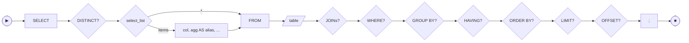

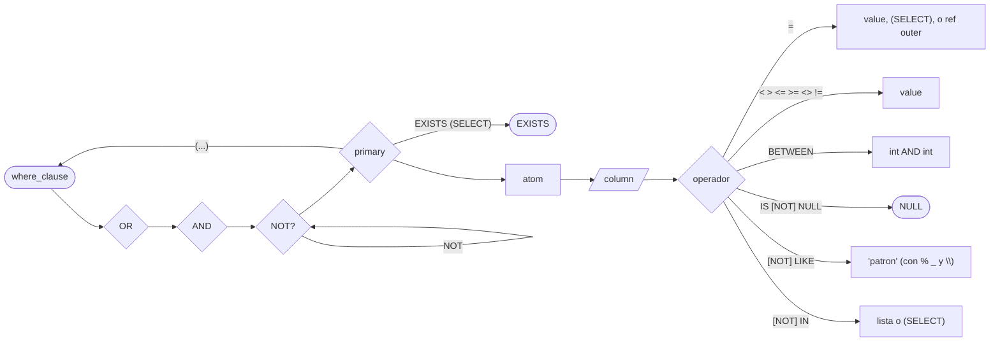

### 📜 EBNF

```
select       ::= "SELECT" ["DISTINCT"] select_list "FROM" identifier
                  ("WHERE" where_clause)?
                  ("GROUP" "BY" identifier ("," identifier)*)?
                  ("HAVING" where_clause)?
                  ("ORDER" "BY" identifier ("ASC" | "DESC")?)?
                  ("LIMIT" integer)?
                  ("OFFSET" integer)?
select_list  ::= "*" | select_item ("," select_item)*
select_item  ::= identifier
              | agg_func "(" agg_arg ")" ["AS" identifier | identifier]
agg_func     ::= "COUNT" | "SUM" | "AVG" | "MIN" | "MAX"
agg_arg      ::= "*" | "DISTINCT" identifier | identifier
where_clause  ::= where_or
where_or      ::= where_and ( "OR" where_and )*
where_and     ::= where_not ( "AND" where_not )*
where_not     ::= "NOT" where_not
                | where_primary
where_primary ::= "(" where_or ")"
                | "EXISTS" "(" select ")"
                | "NOT" "EXISTS" "(" select ")"
                | where_atom
where_atom    ::= identifier "=" ( value | "(" select ")" | qualified_ident )
                | identifier compare_op value
                | identifier "BETWEEN" integer "AND" integer
                | identifier "IS" ["NOT"] "NULL"
                | identifier ["NOT"] "LIKE" string
                | identifier ["NOT"] "IN" "(" value_list ")"
                | identifier "IN" "(" select ")"
compare_op    ::= "<" | "<=" | ">" | ">=" | "<>" | "!="
value_list    ::= value ("," value)*
qualified_ident ::= identifier ( "." identifier )?
```

**Precedencia** (de más baja a más alta): `OR` < `AND` < `NOT` < paréntesis / átomo.
Es la convención estándar SQL: `a OR b AND c` se interpreta como `a OR (b AND c)`.
Los paréntesis fuerzan agrupaciones distintas.

**Lógica trivaluada (3VL)** — el WHERE evalúa con la tabla de verdad de SQL
estándar para NULL:

- `NULL AND false` → `false`; `NULL AND true` → `NULL`; `NULL AND NULL` → `NULL`
- `NULL OR true`  → `true`;  `NULL OR false` → `NULL`; `NULL OR NULL` → `NULL`
- `NOT NULL` → `NULL`
- Una fila sobrevive el filtro solo si la expresión evalúa a `true`;
  `false` y `NULL` (unknown) la descartan.

**Limitación E1**: `EXISTS` correlacionado y `col = otra.col` (column-ref del
outer) **solo se permiten como único átomo del WHERE**. Combinarlos con
`AND`/`OR`/`NOT` devuelve `[GBY-4024]` — soporte completo queda para un
bloque posterior. Subqueries no-correlacionadas (`IN (SELECT)`, `= (SELECT)`,
`EXISTS` no-correlacionado) sí se pueden combinar libremente.

### 🔗 FROM con JOINs (bloque A del roadmap)

```
from_clause ::= table_ref join_clause*
table_ref   ::= identifier [ ["AS"] identifier ]
join_clause ::= ( "," | "CROSS" "JOIN" ) table_ref
              | ( "INNER" "JOIN" | "JOIN" ) table_ref "ON" qualified_ident "=" qualified_ident
              | ( "LEFT"  ["OUTER"] "JOIN" ) table_ref "ON" qualified_ident "=" qualified_ident
              | ( "RIGHT" ["OUTER"] "JOIN" ) table_ref "ON" qualified_ident "=" qualified_ident
              | ( "FULL"  ["OUTER"] "JOIN" ) table_ref "ON" qualified_ident "=" qualified_ident
              | ( "INNER" | "LEFT" ["OUTER"] | "RIGHT" ["OUTER"] | "FULL" ["OUTER"] | ε ) "JOIN" table_ref "USING" "(" identifier ")"
              | "NATURAL" ( "INNER" | "LEFT" ["OUTER"] | "RIGHT" ["OUTER"] | "FULL" ["OUTER"] | ε ) "JOIN" table_ref
```

**Reglas:**
- `INNER JOIN` (o `JOIN` solo, equivalente ANSI) requiere `ON l = r` con un único equi-predicado. `AND`/`OR` y operadores no-equi (`<`, `>`, `BETWEEN`, etc.) en el `ON` siguen pendientes — workaround: filtrarlos en el `WHERE` post-JOIN.
- `CROSS JOIN` (y la comma-syntax `FROM a, b`) NO admite `ON`. Producto cartesiano completo.
- `LEFT [OUTER] JOIN`: preserva todas las filas del lado izquierdo. Cuando no hay match, las columnas del lado derecho aparecen como `NULL`.
- `RIGHT [OUTER] JOIN`: simétrico — preserva todas las del derecho, NULL-fill en el izquierdo.
- `FULL [OUTER] JOIN`: combina ambos comportamientos (toda fila de cualquier lado aparece, con NULL en el otro lado si no hay match).
- El `OUTER` es opcional (estándar SQL): `LEFT JOIN` y `LEFT OUTER JOIN` son sinónimos.
- `JOIN ... USING (col)` es sugar para `JOIN ... ON l.col = r.col`. La columna `col` aparece **una sola vez** en `SELECT *` (ANSI). En este release soporta exactamente UNA columna en la lista (multi-col en backlog).
- `NATURAL JOIN` deriva automáticamente un `USING` con la columna que ambas tablas comparten por nombre. Si las tablas comparten 0 o >1 columnas comunes en este release → `[GBY-4023]`.
- Las tablas se pueden aliasar con `[AS] alias`. El alias **oculta** el nombre real (estándar SQL): si declarás `FROM alumnos a`, después tenés que usar `a.nombre`, no `alumnos.nombre`.
- En SELECT/WHERE/ORDER BY, una columna que existe en >1 tabla **debe** ir cualificada (`tabla.col`); si no, `[GBY-4018]`.
- `SELECT *` en JOIN expande a TODAS las columnas de TODAS las tablas, cada una prefijada con su qualifier para evitar colisiones.

**Complejidad:**
- **Nested-loop puro** (fallback): `O(N1 × N2 × … × Nk)`. Se usa cuando el `ON` no apunta contra PK ni índice del right, o cuando el JOIN es CROSS/RIGHT/FULL.
- **Index-loop** (optimización transparente): `O(N1 × log N2)` por JOIN. Se activa automáticamente cuando se cumplen las 3 condiciones: (a) el `ON` (o el USING/NATURAL derivado) referencia la PK o una columna indexada del right; (b) el tipo de JOIN es `INNER` o `LEFT`; (c) hay un predicate (no aplica a `CROSS`). El engine elige el path por sí mismo — no hace falta cambiar el SQL.

> **Sobre `qualified_ident` en el RHS del `=`:** solo es válido **dentro de una subquery correlacionada** dentro de `EXISTS (...)`. Permite expresar `WHERE inner_col = outer_table.outer_col`, donde `outer_table` es la tabla del SELECT padre. Usarlo fuera de ese contexto devuelve `[GBY-4016]`.
>
> **Sobre `EXISTS`:** la subquery se ejecuta una sola vez si **no** referencia columnas del outer; cuando sí lo hace, se re-ejecuta una vez por cada fila del outer (post-filter). Esta variante correlacionada es O(N × costo_subquery), sin optimizer; tiene sentido cuando la subquery se reduce vía PK/índice con la outer-ref.

> `=` funciona sobre la PK o sobre cualquier columna que tenga índice secundario. `BETWEEN` funciona sobre la PK y sobre cualquier columna `INT` con índice secundario (índice `OrderedInt`, default automático al crear índice sobre `INT`; ver [ADR-0017](adr/0017-int-ordered-index-version-7.md)); para `TEXT`/`FLOAT`/`BOOL`/`DATE`/`DATETIME` indexados, `BETWEEN` queda en el [Camino A](COMMERCIAL_ROADMAP.md). `IN (SELECT …)` acepta subqueries **no-correlacionadas** (la subquery no referencia columnas del outer); la subquery debe devolver exactamente una columna, se ejecuta una sola vez y el resultado se materializa como set para filtrar el outer — la columna del outer debe ser la PK o tener índice secundario, igual que `=`. `ORDER BY` funciona sobre cualquier columna del schema (no requiere índice); el sort es en memoria post-scan, así que para tablas grandes con `LIMIT` chico conviene tener un `WHERE` que reduzca el conjunto antes del sort.

### ✅ Ejemplos

```sql
SELECT * FROM users;
SELECT id, name FROM users LIMIT 10;
SELECT id, name FROM users LIMIT 10 OFFSET 20;

-- Por PK
SELECT * FROM users WHERE id = 1;
SELECT id, name FROM users WHERE id BETWEEN 1 AND 100;

-- Por columna indexada (requiere CREATE INDEX previo)
SELECT * FROM users WHERE name = 'Ana';
SELECT id FROM orders WHERE status = 'pending' LIMIT 50;

-- BETWEEN sobre columna INT indexada (índice OrderedInt, ADR-0017)
-- CREATE INDEX idx_users_score ON users (score);  -- score INT
SELECT id, name FROM users WHERE score BETWEEN 80 AND 100 LIMIT 25;

-- Operadores E2: <, >, <=, >=, <>, !=, LIKE, IS NULL, IN literal
SELECT id FROM users WHERE score < 50;
SELECT id FROM users WHERE score >= 80 AND score <= 100;
SELECT id FROM users WHERE name <> 'Ana';
SELECT id FROM users WHERE name LIKE 'A%';            -- empieza con 'A'
SELECT id FROM users WHERE name LIKE '_eto';          -- 4 chars, termina en 'eto'
SELECT id FROM users WHERE description NOT LIKE '%spam%';
SELECT id FROM users WHERE deleted_at IS NULL;
SELECT id FROM users WHERE id IN (1, 2, 3);
SELECT id FROM users WHERE country NOT IN ('AR', 'BR');
SELECT id FROM products WHERE code LIKE '50\%%';      -- LIKE literal '%' con escape

-- Agregaciones (bloque F): COUNT/SUM/AVG/MIN/MAX, GROUP BY, HAVING, DISTINCT
SELECT COUNT(*) FROM users;
SELECT COUNT(*) AS total FROM users WHERE active = TRUE;
SELECT COUNT(monto), SUM(monto), AVG(monto) FROM ventas;
SELECT region, SUM(monto) AS total
   FROM ventas
  GROUP BY region
  ORDER BY total DESC;
SELECT region, producto, COUNT(*) AS n
   FROM ventas
  GROUP BY region, producto
 HAVING COUNT(*) > 1;
SELECT DISTINCT category FROM products;
SELECT COUNT(DISTINCT user_id) FROM sessions;

-- Reglas ANSI estrictas:
-- - Toda columna no-agregada en el SELECT debe figurar en GROUP BY ([GBY-4027]).
-- - Las funciones agregadas solo se permiten en SELECT y HAVING, no en WHERE ([GBY-4025]).
-- - Sin GROUP BY pero con agregados → UNA fila global (incluso sobre input vacío: COUNT=0, resto=NULL).
-- - Aún no se soportan agregados sobre SELECT con JOIN ([GBY-4028]): reescribir como subquery agregada.

-- AND / OR / NOT + paréntesis (bloque E1)
SELECT id FROM users WHERE active = TRUE AND score BETWEEN 80 AND 100;
SELECT id FROM users WHERE city = 'BA' OR city = 'MDQ';
SELECT id FROM users WHERE NOT status = 'banned';
SELECT id FROM users WHERE (city = 'BA' OR city = 'MDQ') AND active = TRUE;
-- Precedencia estándar: AND ata más fuerte que OR.
SELECT id FROM users WHERE city = 'BA' OR city = 'MDQ' AND active = TRUE;
-- Equivale a: city = 'BA' OR (city = 'MDQ' AND active = TRUE)

-- ORDER BY (cualquier columna; ASC default; NULLs primero)
SELECT id, name FROM users ORDER BY name ASC;
SELECT id, name FROM users ORDER BY score DESC LIMIT 10;
SELECT id FROM orders WHERE status = 'pending' ORDER BY total DESC LIMIT 5 OFFSET 10;

-- IN (SELECT …) — subquery no-correlacionada
-- Requiere: outer.curso_id indexado (o ser PK) e inner.nivel indexado (o ser PK).
SELECT nombre FROM alumnos
 WHERE curso_id IN (SELECT id FROM cursos WHERE nivel = '3 Medio');

-- IN sobre PK directa (no requiere índice en el outer):
SELECT id, label FROM t WHERE id IN (SELECT ref_id FROM picks);

-- = (SELECT …) — subquery escalar (1 columna × ≤1 fila).
-- Si la subquery devuelve 0 filas o NULL, el match es vacío (semántica ANSI).
-- Si devuelve >1 fila, error [GBY-4014] — usar IN (...) en su lugar.
SELECT nombre FROM alumnos
 WHERE curso_id = (SELECT id FROM cursos WHERE nombre = 'matematica');

-- EXISTS no-correlacionada: la subquery se ejecuta UNA vez.
SELECT id FROM padre WHERE EXISTS (SELECT id FROM auditoria WHERE id = 1);

-- EXISTS correlacionada: re-ejecuta por cada fila del outer.
-- Padres que tienen al menos un hijo:
SELECT id, nombre FROM padre
 WHERE EXISTS (SELECT id FROM hijo WHERE parent_id = padre.id);

-- NOT EXISTS correlacionado: padres sin hijos.
SELECT id, nombre FROM padre
 WHERE NOT EXISTS (SELECT id FROM hijo WHERE parent_id = padre.id);

-- INNER JOIN clásico con aliases y columnas cualificadas
SELECT a.nombre, c.nombre FROM alumnos a
 INNER JOIN cursos c ON a.curso_id = c.id
 ORDER BY a.nombre ASC;

-- JOIN de 3 tablas en cadena (left-deep)
SELECT persona.nombre, ciudad.nombre, pais.nombre
  FROM persona
  JOIN ciudad ON persona.ciudad_id = ciudad.id
  JOIN pais   ON ciudad.pais_id = pais.id;

-- CROSS JOIN explícito (cartesian product)
SELECT a.v, b.w FROM a CROSS JOIN b;

-- Comma-syntax = CROSS JOIN
SELECT a.v, b.w FROM a, b;

-- Self-join vía aliases distintos
SELECT e.nombre, j.nombre FROM empleado e
  INNER JOIN empleado j ON e.jefe_id = j.id;

-- WHERE sobre columna cualificada de cualquier tabla
SELECT alumnos.nombre FROM alumnos
  JOIN cursos ON alumnos.curso_id = cursos.id
 WHERE cursos.nivel = '3M';

-- LEFT JOIN: padres sin hijos aparecen con etiqueta NULL
SELECT padre.nombre, hijo.etiqueta FROM padre
  LEFT JOIN hijo ON padre.id = hijo.parent_id
 ORDER BY padre.id ASC;

-- RIGHT JOIN: filas del derecho sin match aparecen con columnas del izq en NULL
SELECT a.v, b.w FROM a
  RIGHT JOIN b ON a.id = b.a_id;

-- FULL OUTER JOIN: combina LEFT + RIGHT en un solo paso
SELECT a.v, b.w FROM a
  FULL OUTER JOIN b ON a.id = b.a_id;

-- USING (col) — sugar para ON l.col = r.col; SELECT * dedup la columna
SELECT ciudad.nombre, pais.nombre_pais
  FROM ciudad JOIN pais USING (pais_id);

-- NATURAL JOIN — auto-detecta la columna común por nombre
SELECT ciudad.nombre, pais.nombre_pais
  FROM ciudad NATURAL JOIN pais;
```

### ❌ Errores típicos

| Mensaje | Causa |
| :--- | :--- |
| `tabla no existe: X` | la tabla no está creada en la DB |
| `ORDER BY: columna 'X' no existe en 'Y'` | la columna del ORDER BY no está en el schema de la tabla |
| `WHERE solo soporta PK (X) o columnas con índice secundario; 'Y' no está indexada` `[GBY-4001]` | aplica al fast-path indexado de `SELECT` (`=` o `BETWEEN` sobre columna sin índice). El WHERE compuesto con `AND`/`OR`/`NOT`/`<`/`>`/`LIKE`/`IS NULL`/`IN literal` cae a FullScan y no exige índice. |
| `WHERE: no se reconoció el operador después de la columna 'X'` `[GBY-4001]` | operador fuera de la gramática actual del WHERE. Lista soportada: `=`, `<`, `>`, `<=`, `>=`, `<>`/`!=`, `BETWEEN`, `IS [NOT] NULL`, `[NOT] LIKE`, `[NOT] IN (lista | SELECT)`, `EXISTS`. |
| `subquery en IN debe devolver exactamente 1 columna; devolvió N` | la subquery proyectó más de una columna — reescribila con una sola |
| `subquery escalar debe devolver exactamente 1 columna; devolvió N` | igual que el anterior pero en `= (SELECT ...)` |
| `subquery escalar en WHERE devolvió N filas; debe devolver a lo sumo 1` | la subquery escalar matcheó más de una fila — agregar `WHERE`/`LIMIT 1` o usar `IN (SELECT ...)` |
| `WHERE IN solo soporta PK (X) o columnas con índice secundario; 'Y' no está indexada` `[GBY-4013]` | aplica solo cuando el WHERE es `col IN (SELECT)` como **único átomo** (fast-path). El WHERE compuesto (`col IN (SELECT) AND ...`) cae a FullScan + 3VL y no exige índice. |
| `EXISTS requiere '(SELECT ...)' a continuación` `[GBY-4015]` | `EXISTS` no seguido por un paréntesis abriendo un `SELECT` |
| `outer column 'X.Y' fuera de alcance` `[GBY-4016]` | `col = outer.col` usado fuera de un `EXISTS (...)` correlacionado, o la tabla outer no coincide con la del outer-stack |
| `PRIMARY KEY 'X' es INT; valor incompatible en WHERE` | pasaste un string a una PK INT |

---

## UPDATE

### 🛤️ Railroad

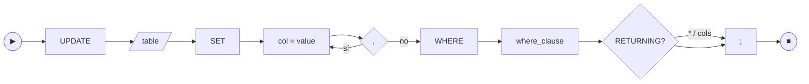

### 📜 EBNF

```
update       ::= "UPDATE" identifier "SET" assignment ("," assignment)*
                  "WHERE" where_clause
                  returning_clause?
assignment   ::= identifier "=" value
```

`where_clause` y `returning_clause` son los mismos definidos en `SELECT`
y `INSERT` respectivamente — ver esas secciones.

Desde el bloque **E3** el `WHERE` de `UPDATE` acepta exactamente la misma
gramática que `SELECT`: combinadores `AND`/`OR`/`NOT`, paréntesis, todos los
operadores E1+E2 (`=`, `<`, `>`, `<=`, `>=`, `<>`/`!=`, `LIKE`, `IS NULL`,
`IN literal`, `BETWEEN`) y subqueries (`IN (SELECT)`, `= (SELECT)`,
`EXISTS`). El `UPDATE` se aplica a **todas** las filas que el `WHERE`
matchee; el `message` del response trae la cuenta.

### ✅ Ejemplos

```sql
-- Por PK directa
UPDATE users SET name = 'Ana M' WHERE id = 1;

-- Multi-asignación
UPDATE orders
   SET status = 'paid', total = 199.50
 WHERE id = 42;

-- Por columna indexada (afecta a todas las filas matcheadas)
UPDATE users SET active = FALSE WHERE city = 'BA';

-- Por predicado compuesto (E1+E2)
UPDATE products SET on_sale = TRUE
 WHERE price < 100 AND stock > 0 AND name LIKE '%demo%';

-- Por subquery
UPDATE users SET status = 'banned'
 WHERE id IN (SELECT uid FROM blacklist);
```

### ❌ Errores típicos

| Mensaje | Causa |
| :--- | :--- |
| `fila no existe: PK=N` | el WHERE era `pk = N` y N no está en la tabla. Solo aplica al fast-path de PK literal; un WHERE compuesto con 0 matches devuelve OK con cuenta 0. |
| `no se permite cambiar la PRIMARY KEY en UPDATE (esta versión)` | se intentó `SET pk = ...` |
| `columna duplicada en SET` | dos asignaciones a la misma columna |

> Solo los índices cuya columna está en el `SET` se tocan; los demás no pagan costo. La resolución del WHERE en E3 hace **FullScan + filtro 3VL** salvo cuando el WHERE es exactamente `pk = N` (fast-path por PK). La optimización para `= col_indexada` y `IN (SELECT)` queda en backlog (correctitud primero). Ver [src/sql.rs:exec_update](../src/sql.rs).

---

## DELETE

### 🛤️ Railroad

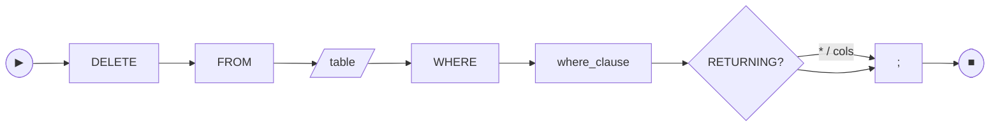

### 📜 EBNF

```
delete  ::= "DELETE" "FROM" identifier "WHERE" where_clause
            returning_clause?
```

`where_clause` y `returning_clause` son los mismos definidos en `SELECT`
e `INSERT` respectivamente.

Mismo `where_clause` que `SELECT` y `UPDATE` (bloque E3). Borra todas las
filas matcheadas en orden de PK ascendente; las FK con `ON DELETE CASCADE`
se aplican fila por fila. El `message` del response trae la cuenta.

### ✅ Ejemplos

```sql
-- Por PK
DELETE FROM users WHERE id = 5;

-- Por columna indexada (multi-fila)
DELETE FROM logs WHERE level = 'debug';

-- Por subquery
DELETE FROM sessions WHERE user_id IN (SELECT id FROM users WHERE banned = TRUE);

-- Por predicado compuesto
DELETE FROM tickets WHERE status = 'closed' AND updated_at < '2024-01-01';
```

### ❌ Errores típicos

| Mensaje | Causa |
| :--- | :--- |
| `fila no existe: PK=N` | el WHERE era `pk = N` y N no está. Con WHERE compuesto, 0 matches es OK. |
| `violación de FK: 'X.col' referencia 'Y' (ON DELETE RESTRICT, N fila(s) afectadas)` | hay filas hijas y la FK fue declarada `ON DELETE RESTRICT` (default) |

> Antes de borrar la fila, el engine la lee para evictar la entrada correspondiente de cada índice secundario. Si la tabla tiene FKs entrantes, el motor resuelve cascade/restrict iterativamente con un worklist y cycle protection (visited set sobre `(tabla, pk)`). Para tablas grandes con FKs entrantes, **se recomienda crear un índice secundario sobre la columna FK del hijo** — el engine lo usa automáticamente para que el lookup de hijos sea O(log n) en vez de full scan.

---

## TRUNCATE

> Bloque J (2026-05-25). Borra todas las filas de la tabla manteniendo
> el schema (columnas, índices, FKs). Implementación naive: scan de
> todas las PKs + `delete_with_cascade` por fila. **Respeta** las
> declaraciones `ON DELETE CASCADE` / `RESTRICT` de FKs entrantes —
> no es un O(1) hack como en Postgres/MySQL.

### 📜 EBNF

```
truncate ::= "TRUNCATE" ["TABLE"] identifier
```

### ✅ Ejemplos

```sql
TRUNCATE TABLE logs;          -- borra todo `logs`
TRUNCATE staging;             -- la palabra TABLE es opcional
```

### ❌ Errores típicos

| Mensaje | Causa |
| :--- | :--- |
| `tabla no existe: X` | la tabla no está en el catálogo |
| `violación de FK: ... ON DELETE RESTRICT, N fila(s) afectadas` | hay filas hijas con FK `ON DELETE RESTRICT` apuntando a la tabla — no se puede vaciar sin borrar primero los hijos |

---

## Transacciones explícitas (`BEGIN` / `COMMIT` / `ROLLBACK`)

> Bloque T (2026-05-25). Por defecto cada batch enviado a `/exec` (HTTP)
> o cada invocación de `gabysql exec` (CLI) es una **transacción atómica
> implícita**: o se commitean todas las sentencias del batch o ninguna.
> `BEGIN`/`COMMIT`/`ROLLBACK` permiten ademas abortar el batch a mitad
> de camino y obtener feedback explícito por sentencia.

### 📜 EBNF

```
tcl ::= "BEGIN" ["TRANSACTION" | "WORK"]
      | "START" "TRANSACTION"
      | "COMMIT" ["TRANSACTION" | "WORK"]
      | "END" ["TRANSACTION" | "WORK"]
      | "ROLLBACK" ["TRANSACTION" | "WORK"]
```

Sinónimos ANSI aceptados: `BEGIN` = `START TRANSACTION`. `COMMIT` = `END`.
Las palabras `TRANSACTION` y `WORK` después de `BEGIN`/`COMMIT`/`END`/`ROLLBACK` son opcionales.

### ✅ Ejemplos

```sql
BEGIN;
  INSERT INTO ledger (id, amount) VALUES (1, 100);
  INSERT INTO ledger (id, amount) VALUES (2, -100);
COMMIT;

-- Aborto a mitad de batch:
BEGIN;
  UPDATE inventory SET stock = stock - 1 WHERE sku = 'ABC';
  -- ... validación adicional falla ...
ROLLBACK;
```

### ⚠️ Limitaciones

- **`ROLLBACK` descarta TODO el cache del Pager**: en un batch que mezcla sentencias antes y después de `BEGIN`, las anteriores también se pierden. `BEGIN`/`ROLLBACK` funciona limpio cuando `BEGIN` es la primera sentencia del batch.
- **No hay transacciones cross-request en el server HTTP**: cada `/exec` es independiente. Mantener una tx abierta entre requests requiere session state — pendiente para una iteración futura.
- **`SAVEPOINT` / `ROLLBACK TO SAVEPOINT`** no implementados (P1).
- **`SET TRANSACTION ISOLATION LEVEL ...`** y `BEGIN READ ONLY` no implementados (P2).

### ❌ Errores típicos

| Mensaje | Causa |
| :--- | :--- |
| `[GBY-4029] BEGIN: ya hay una transacción explícita abierta` | dos `BEGIN` consecutivos sin `COMMIT`/`ROLLBACK` intermedio |
| `[GBY-4030] COMMIT/ROLLBACK: no hay transacción explícita activa` | `COMMIT` o `ROLLBACK` sin `BEGIN` previo |

---

## Funciones escalares (bloques G1 + G2 + G3)

> Desde el **bloque G1 (2026-05-26)**, el `SELECT` list acepta expresiones escalares además de columnas crudas y agregadas: funciones built-in (`LENGTH`, `UPPER`, `CONCAT`, …), `CAST(x AS TYPE)`, `CASE … END`, literales, y los conditionals `COALESCE`/`NULLIF`/`IFNULL`/`IF`. Cada expresión puede recibir `AS alias` para nombrar la columna del `ResultSet`.
>
> El **bloque G2 (2026-05-26)** extiende esas mismas expresiones a las superficies de filtrado y mutación:
> - **`WHERE`** (incluye el WHERE de `SELECT`, `UPDATE`, `DELETE`): cualquier `Expr` que evalúe a BOOL/NULL puede ser un átomo del WHERE. Forma típica: `WHERE LENGTH(nombre) > 3`, `WHERE UPPER(nombre) = 'ANA'`, `WHERE COALESCE(activo, false) = true`, `WHERE 5 < LENGTH(nombre)` (LHS literal, RHS función).
> - **`HAVING`**: igual que WHERE, con la libertad ya existente de referir agregados. Ej: `HAVING UPPER(grupo) = 'X'`.
> - **`UPDATE SET col = <expr>`** y **`ON CONFLICT DO UPDATE SET col = <expr>`**: la RHS puede ser cualquier `Expr`. Se evalúa contra la fila **pre-update**, así que `SET a = b, b = a` deja ambos con los valores intercambiados (las dos RHS ven el snapshot original).
>
> El **bloque G3 (2026-05-26)** cierra la familia:
> - **Operadores aritméticos binarios `+`, `-`, `*`, `/`, `%`** sobre INT/FLOAT con promoción implícita (INT+FLOAT → FLOAT). Overflow → `[GBY-4042]`; división/módulo por cero → `[GBY-4043]`; tipos inválidos → `[GBY-4044]`.
> - **Operador `||` (concat)** con misma precedencia que `+`/`-` (regla PostgreSQL). Cualquier tipo se reduce a TEXT; NULL propaga (ANSI estricta).
> - **Postfix predicates sobre `Expr`**: `LENGTH(x) IS NULL`, `UPPER(x) LIKE 'A%'`, `LENGTH(x) IN (3,4,5)`, `LENGTH(x) BETWEEN 3 AND 10` (más sus formas `NOT ...`).
> - **Funciones escalares P2/P3**: `TRIM`/`LTRIM`/`RTRIM`, `REPLACE`, `SPLIT_PART`, `CEIL`/`FLOOR`, `MOD`, `POWER`/`SQRT`, `DATE_ADD`/`DATE_SUB`, `DATEDIFF`, `EXTRACT`, `STRFTIME`.
>
> **Pendientes residuales menores**: `EXCLUDED.col` dentro de `ON CONFLICT DO UPDATE SET` y unary `-` prefix sobre expresión (se puede escribir `0 - LENGTH(x)`).
>
> **NULL propagation**: por defecto cualquier argumento `NULL` hace que la función devuelva `NULL`. Las excepciones son `COALESCE`/`NULLIF`/`IFNULL`/`IF`/`Now`/`CurrentDate`/`CurrentTimestamp` (la primera tiene su propio short-circuit, las últimas no tienen args).

### 📜 EBNF mínima

```
select_item    = expression [ "AS" ident | ident ] ;
expression     = arith [ cmp_op arith | postfix ] ;
postfix        = "IS" [ "NOT" ] "NULL"
               | [ "NOT" ] "LIKE" string_literal
               | [ "NOT" ] "IN" "(" value { "," value } ")"
               | [ "NOT" ] "BETWEEN" arith "AND" arith ;
arith          = arith_term { ( "+" | "-" | "||" ) arith_term } ;
arith_term     = arith_factor { ( "*" | "/" | "%" ) arith_factor } ;
arith_factor   = primary ;
primary        = literal
               | qualified_ident
               | func_call
               | "CAST" "(" expression "AS" type_name ")"
               | "CASE" [ expression ] ( "WHEN" expression "THEN" expression )+
                 [ "ELSE" expression ] "END"
               | "(" expression ")" ;
func_call      = ident "(" [ expression { "," expression } ] ")"
               | "EXTRACT" "(" extract_field "FROM" expression ")"
               | "CURRENT_DATE" | "CURRENT_TIMESTAMP" ;
extract_field  = "YEAR" | "MONTH" | "DAY" | "HOUR" | "MINUTE" | "SECOND" ;
cmp_op         = "=" | "<>" | "!=" | "<" | "<=" | ">" | ">=" ;
type_name      = "INT" | "FLOAT" | "TEXT" | "BOOL" | "DATE" | "DATETIME" | "JSON" ;
```

### 🧮 Operadores aritméticos (bloque G3)

| Operador | Precedencia | Notas |
| :---: | :---: | :--- |
| `*` `/` `%` | Alta | Multiplicación, división, módulo. INT×INT con `checked_*` → overflow `[GBY-4042]`. División o módulo por cero → `[GBY-4043]`. |
| `+` `-` `\|\|` | Baja | Suma, resta y concat. `\|\|` reduce ambos lados a TEXT con la misma regla que `CONCAT` (NULL propaga). Promoción INT+FLOAT → FLOAT en `+`/`-`. |

- NULL en cualquier lado → NULL (3VL).
- Tipos incompatibles (`'abc' + 1`, `true * 2`, …) → `[GBY-4044]`.
- Para forzar precedencia distinta, usar paréntesis.

### 🧰 Funciones soportadas (G1 + G3)

| Familia | Función | Notas |
| :--- | :--- | :--- |
| String | `LENGTH(s)` | Largo en caracteres (no bytes). Solo TEXT. Aliases: `LEN`, `CHAR_LENGTH`. |
| String | `UPPER(s)` / `LOWER(s)` | Solo TEXT. |
| String | `SUBSTR(s, from [, len])` | `from` es 1-based; `from <= 0` se trata como 1. Alias: `SUBSTRING`. |
| String | `CONCAT(a, b, …)` | Convierte cada arg a texto. NULL propaga (ANSI). |
| String (G3) | `TRIM(s)` / `LTRIM(s)` / `RTRIM(s)` | Solo TEXT. Strip de whitespace ambos lados / izq / der. |
| String (G3) | `REPLACE(s, from, to)` | Solo TEXT. Reemplazo no-overlap. `from = ''` deja `s` sin cambios. |
| String (G3) | `SPLIT_PART(s, sep, idx)` | 1-based; `idx <= 0` → `[GBY-4035]`; fuera de rango → `''`. |
| Numéricas | `ABS(x)` | INT o FLOAT. |
| Numéricas | `ROUND(x)` / `ROUND(x, n)` | INT pasa tal cual; FLOAT redondea al entero o a `n` decimales. |
| Numéricas (G3) | `CEIL(x)` / `CEILING(x)` / `FLOOR(x)` | INT pasa tal cual; FLOAT aplica `.ceil()` / `.floor()`. |
| Numéricas (G3) | `MOD(a, b)` | Mismo semántica que el operador `%`. Cero → `[GBY-4043]`. |
| Numéricas (G3) | `POWER(x, y)` / `POW(x, y)` | Devuelve FLOAT. `POWER(0, y<0)` → `[GBY-4045]`. |
| Numéricas (G3) | `SQRT(x)` | Devuelve FLOAT. Negativo → `[GBY-4045]`. |
| Fecha / hora | `NOW()` / `CURRENT_TIMESTAMP` | UTC, formato `YYYY-MM-DD HH:MM:SS` como TEXT. |
| Fecha / hora | `CURRENT_DATE` | UTC, formato `YYYY-MM-DD` como TEXT. Alias: `CURDATE`. |
| Fecha / hora (G3) | `DATE_ADD(d, n)` / `DATE_SUB(d, n)` | `d` es DATE o DATETIME; suma/resta `n` días al date-part, preservando time-part en DATETIME. |
| Fecha / hora (G3) | `DATEDIFF(d1, d2)` | Días entre `d1` y `d2` (`d1 - d2`), usando solo date-part. |
| Fecha / hora (G3) | `EXTRACT(field FROM d)` | `field`: `YEAR`/`MONTH`/`DAY`/`HOUR`/`MINUTE`/`SECOND`. Sintaxis especial (no es coma). |
| Fecha / hora (G3) | `STRFTIME(fmt, d)` | Placeholders mínimos: `%Y %m %d %H %M %S %%`. Otros `%X` pasan literal. |
| Conversión | `CAST(x AS TYPE)` | Tipos: INT, FLOAT, TEXT, BOOL, DATE, DATETIME, JSON. Errores → `[GBY-4036]`. |
| Condicional | `COALESCE(a, b, …)` | Primer argumento no-NULL. Todos NULL → NULL. |
| Condicional | `NULLIF(a, b)` | NULL si `a = b`, sino `a`. |
| Condicional | `IFNULL(a, b)` | `a` si no-NULL, sino `b`. |
| Condicional | `IF(cond, a, b)` | `cond` debe ser BOOL. Alias: `IIF`. |
| Condicional | `CASE WHEN cond THEN val [...] [ELSE val] END` | Searched form: `cond` debe evaluar a BOOL (NULL = no-match). |
| Condicional | `CASE expr WHEN x THEN val [...] [ELSE val] END` | Simple form: matchea `x` contra `expr` por igualdad ANSI (NULL ≠ NULL). |

### ✅ Ejemplos

```sql
SELECT id, UPPER(name) AS n FROM users WHERE id = 1;

SELECT
  CASE WHEN score >= 90 THEN 'A'
       WHEN score >= 75 THEN 'B'
       ELSE 'C' END AS grade
FROM exams;

SELECT COALESCE(nickname, name, 'anónimo') FROM users;

SELECT CAST(price AS TEXT) || '?' FROM products; -- G3: `||` soportado
SELECT CONCAT(CAST(price AS TEXT), '?') FROM products; -- forma equivalente

-- G2: expresiones en WHERE, HAVING, UPDATE SET
SELECT id FROM users WHERE LENGTH(name) > 3;
SELECT id FROM users WHERE UPPER(name) = 'ANA';
SELECT id FROM users WHERE COALESCE(active, false) = true;
SELECT id FROM users WHERE CASE WHEN age > 18 THEN true ELSE false END = true;

SELECT g, COUNT(*) FROM t GROUP BY g HAVING UPPER(g) = 'X';

UPDATE users SET name = UPPER(name) WHERE id = 1;
UPDATE users SET descr = COALESCE(descr, 'sin descr') WHERE id = 2;
UPDATE users SET tier = CASE WHEN age >= 18 THEN 'adult' ELSE 'minor' END;
DELETE FROM users WHERE LENGTH(name) = 0;

-- G3: aritméticos, concat, postfix Expr y funciones P2/P3
SELECT precio * cantidad AS total FROM ventas;
SELECT id FROM ventas WHERE precio * 1.21 > 1000;
UPDATE ventas SET contador = contador + 1 WHERE id = 1;
SELECT nombre || ' ' || apellido AS fullname FROM users;
SELECT id FROM users WHERE LENGTH(name) IS NULL;
SELECT id FROM users WHERE UPPER(name) LIKE 'A%';
SELECT id FROM users WHERE LENGTH(name) IN (3, 4, 5);
SELECT id FROM users WHERE LENGTH(name) BETWEEN 3 AND 10;
SELECT TRIM('  hola  '), REPLACE('a-b-c', '-', '_'), SPLIT_PART('a-b-c', '-', 2);
SELECT CEIL(1.2), FLOOR(1.8), MOD(10, 3), POWER(2, 10), SQRT(16);
SELECT DATE_ADD('2026-01-01', 31), DATEDIFF('2026-12-31', '2026-01-01');
SELECT EXTRACT(YEAR FROM '2026-05-26'), STRFTIME('%Y-%m', '2026-05-26');
```

### ❌ Errores típicos

| Error | Causa |
| :--- | :--- |
| `[GBY-4034] LENGTH: cantidad incorrecta de argumentos` | función llamada con la aridad equivocada (e.g. `LENGTH()`). |
| `[GBY-4035] LENGTH requiere TEXT, recibí INT` | argumento de un tipo no aceptado por la función. |
| `[GBY-4036] CAST('xyz' AS INT): no es un entero válido` | conversión imposible al tipo destino. |
| `[GBY-4037] función escalar desconocida: 'FOO'` | nombre no presente en la lista soportada. |
| `[GBY-4038] CASE WHEN: la condición debe ser BOOL, recibí INT` | `CASE WHEN x THEN …` con `x` no booleano. |
| `[GBY-4039] EXPR_IN_PREDICATE_NOT_SUPPORTED` | G2 (cerrado por G3): postfix sobre Expr ahora funciona; el código queda reservado y sin emisión activa. |
| `[GBY-4040] expresión en WHERE/HAVING debe evaluar a BOOL (o NULL)` | G2: predicado expresional sin comparador (`WHERE LENGTH(x)`) — falta `>`/`=`/etc. |
| `[GBY-4041] UPDATE sobre 't': el valor calculado para 'col' es TEXT y la columna es INT` | G2: la RHS de un `SET col = <expr>` rinde un tipo incompatible — envolver con `CAST(... AS T)`. |
| `[GBY-4042] overflow aritmético en INT: 9223372036854775807 + 1` | G3: operación entera con overflow — promover a FLOAT con `CAST`. |
| `[GBY-4043] división entera por cero` | G3: divisor cero en `/` o `%`. Usar `NULLIF(div, 0)` o pre-filtrar. |
| `[GBY-4044] operador '+' no acepta operandos TEXT y INT` | G3: operador aritmético sobre tipos incompatibles. ¿Quisiste decir `\|\|`? |
| `[GBY-4045] SQRT(-1) indefinido en reales (argumento negativo)` | G3: función matemática fuera del dominio real. |
| `[GBY-4046] DATE_ADD: '2026-13-01' no es DATE ni DATETIME válido` | G3: TEXT no parseable como fecha en una función de fecha. |
| `[GBY-4047] EXTRACT: campo 'CENTURY' no soportado` | G3: `EXTRACT(<campo> FROM ...)` con campo no permitido. |

---

## Subqueries y derived tables (bloque H)

> Bloque H (2026-05-26) cierra los P0+P1 de subqueries: derived tables, `NOT IN (SELECT)`, subquery escalar en SELECT list, y multi-predicate correlated EXISTS dentro de `AND`/`OR`/`NOT`.

### 📜 EBNF

```ebnf
from_source   := tabla_ident [ alias ]
               | "(" subquery ")" alias       (* derived table — alias OBLIGATORIO *)

subquery      := "SELECT" select_stmt

scalar_subq   := "(" subquery ")"             (* dentro de Expr *)

where_atom    := … (formas pre-H) …
               | columna [ "NOT" ] "IN" "(" subquery ")"   (* H *)
               | "EXISTS" "(" subquery ")"                  (* puede ir dentro de AND/OR/NOT — H *)
               | "NOT" "EXISTS" "(" subquery ")"            (* idem *)

expr_primary  := … (formas pre-H) …
               | scalar_subq                  (* H *)
```

### ✅ Ejemplos

```sql
-- Derived table: lista de cursos con cantidad de alumnos.
SELECT sub.curso_id, sub.total
FROM (SELECT curso_id, COUNT(*) AS total FROM alumnos GROUP BY curso_id) AS sub
ORDER BY sub.total DESC;

-- Derived table joineada con una tabla persistente.
SELECT cursos.nivel, sub.total
FROM cursos
INNER JOIN (SELECT curso_id, COUNT(*) AS total FROM alumnos GROUP BY curso_id) AS sub
  ON cursos.id = sub.curso_id;

-- NOT IN con 3VL ANSI estricta.
SELECT id FROM cursos
WHERE id NOT IN (SELECT curso_id FROM alumnos WHERE edad = 19);

-- Subquery escalar en SELECT list (correlated).
SELECT cursos.id,
       (SELECT COUNT(*) FROM alumnos WHERE alumnos.curso_id = cursos.id) AS cnt
FROM cursos;

-- EXISTS correlacionado combinado con otro predicado.
SELECT id FROM cursos
WHERE EXISTS (SELECT 1 FROM alumnos WHERE alumnos.curso_id = cursos.id)
  AND id = 1;
```

### ⚠️ Reglas y limitaciones

- **Alias obligatorio** en derived tables (ANSI estricto, `[GBY-4048]`). Sin él el parser rechaza.
- **Sin nombres duplicados** en el output de una derived table (`[GBY-4049]`). Usar alias internos para des-ambiguar.
- **Inferencia de tipo** por columna del derived: si todos los valores no-NULL son de la misma variante (INT/FLOAT/BOOL/TEXT), el schema virtual usa ese tipo; mezcla → fallback a TEXT.
- **Sin índices** sobre derived (always full-scan en el outer). Sin UPDATE/DELETE/INSERT sobre una derived table.
- **NOT IN + NULL**: si la subquery proyecta algún NULL, `col NOT IN (...)` devuelve NULL para todos los outer rows que no matcheen exactamente. Es la regla ANSI estricta — distinta de `NOT (col IN ...)` cuando hay match.
- **Subquery escalar**: exactamente 1 columna y a lo sumo 1 fila. 0 filas → NULL. más de 1 → `[GBY-4014]`. más de 1 columna → `[GBY-4011]`.
- **Correlated multi-predicado**: `EXISTS` y `col = outer.col` correlacionados ahora funcionan dentro de `AND`/`OR`/`NOT` (el código histórico `[GBY-4024]` queda deprecado).

### ❌ Errores típicos

| Mensaje | Por qué |
|---|---|
| `[GBY-4048] derived table (SELECT ...) requiere un alias obligatorio` | El parser vio `FROM (SELECT ...)` sin alias. |
| `[GBY-4049] derived table 'x' proyecta dos columnas con el mismo nombre 'id'` | La subquery devuelve nombres duplicados. Aliasear: `SELECT a AS x, b AS y`. |
| `[GBY-4014] subquery escalar … devolvió 5 filas` | Subquery en SELECT list o en `WHERE = (SELECT ...)` con más de una fila. |
| `[GBY-4011] subquery … debe devolver exactamente 1 columna` | La subquery escalar/IN devuelve múltiples columnas. |

---

## Set operations y `VALUES` (bloque I)

> **Operaciones de conjunto entre queries** (`UNION` / `INTERSECT` / `EXCEPT`) con su variante `ALL`, alias `MINUS` de Oracle, y **`VALUES`** usable como query standalone o como tabla virtual dentro del FROM.

### 📜 EBNF

```
select_query    ::= select_term { ( "UNION" | "EXCEPT" | "MINUS" ) [ "ALL" ] intersect_term }*
                    [ "ORDER" "BY" ident [ "ASC" | "DESC" ] ]
                    [ "LIMIT" int ] [ "OFFSET" int ]
intersect_term  ::= select_term { "INTERSECT" [ "ALL" ] select_term }*
select_term     ::= select_stmt
                  | values_stmt
                  | "(" select_query ")"
values_stmt     ::= "VALUES" row { "," row }*
row             ::= "(" expr { "," expr }* ")"
```

### 🪜 Precedencia (ANSI)

1. `INTERSECT` (más alta — ata más fuerte).
2. `UNION` y `EXCEPT` / `MINUS` (misma precedencia, asociativos a izquierda).

`A UNION B INTERSECT C` se parsea como `A UNION (B INTERSECT C)`. Para forzar otro orden, usar paréntesis.

### 🧮 Semántica de multisets

- **`UNION ALL`**: append (preserva duplicados). `count_out = count_l + count_r`.
- **`UNION`** (sin `ALL`): append + dedup. `count_out = 1` para cada fila distinta.
- **`INTERSECT ALL`**: `count_out = min(count_l, count_r)` por fila distinta.
- **`INTERSECT`**: `count_out = 1` para cada fila presente en ambos.
- **`EXCEPT ALL`**: `count_out = max(0, count_l - count_r)` por fila distinta.
- **`EXCEPT`**: `count_out = 1` para cada fila presente en LHS y no en RHS.
- Dos `NULL` son **iguales** acá (comportamiento ANSI de set ops).

### 🪧 Compatibilidad columna a columna

- Ambos lados deben tener la **misma arity** (`[GBY-4054]` si no).
- Los tipos deben ser **compatibles**: INT/FLOAT promueven entre sí, cualquier otra mezcla rompe con `[GBY-4055]`. NULL no chequea tipo.
- Los **headers del output** vienen del LHS (regla ANSI: el primer SELECT impone los nombres).

### ✅ Ejemplos

```sql
-- Unión simple con dedup
SELECT id FROM a UNION SELECT id FROM b ORDER BY id ASC;

-- Unión preservando duplicados
SELECT nombre FROM clientes_2024 UNION ALL SELECT nombre FROM clientes_2025;

-- Intersección + ORDER BY al nivel del resultado
(SELECT id FROM activos) INTERSECT (SELECT id FROM premium) ORDER BY id DESC LIMIT 10;

-- Diferencia con alias MINUS
SELECT id FROM a MINUS SELECT id FROM b;

-- VALUES standalone (devuelve ResultSet con headers column1, column2, ...)
VALUES (1, 'a'), (2, 'b'), (3, 'c');

-- VALUES como tabla virtual en FROM
SELECT id, name FROM (VALUES (1, 'a'), (2, 'b')) AS t(id, name) ORDER BY id ASC;

-- JOIN entre persistente y VALUES virtual
SELECT a.id, t.tag
FROM a INNER JOIN (VALUES (1, 'uno'), (3, 'tres')) AS t(id, tag) ON a.id = t.id;

-- Precedencia: INTERSECT ata más fuerte que UNION
-- ( == A UNION (B INTERSECT C) )
VALUES (1), (2) UNION VALUES (3), (4) INTERSECT VALUES (4), (5);
-- → 1, 2, 4
```

### ❌ Errores típicos

| Mensaje | Causa |
| :--- | :--- |
| `[GBY-4054] UNION entre queries con N y M columnas` | Distinta arity entre LHS y RHS. |
| `[GBY-4055] UNION: la columna K del LHS es Int y la del RHS es Text` | Tipos incompatibles (sin promoción INT↔FLOAT). |
| `[GBY-4052] VALUES en FROM requiere alias de tabla obligatorio` | Falta `AS t(c1, c2, ...)` tras `(VALUES ...)`. |
| `[GBY-4053] lista de aliases de columna tiene X entradas pero las filas de VALUES tienen Y` | Mismatch entre `t(c1, c2)` y la arity de las tuplas. |
| `[GBY-4056] VALUES: fila K tiene N expresiones pero la fila 1 tiene M` | Dos filas del VALUES con distinta arity. |
| `[GBY-4057] VALUES requiere al menos una fila` | `VALUES;` sin tuplas. |

### ⚠️ No soportado todavía

- `WITH ... AS (...)` / CTE — bloque W (planificado aparte).
- `ORDER BY 1` posicional sobre el output de un set op (usar nombre).
- Set ops dentro de `UPDATE` / `DELETE` (no es ANSI estándar).
- `ALL` / `ANY` / `SOME` sobre subqueries (backlog H-P2).

---

## INTEGRITY CHECK

> Recorre la DB abierta y reporta toda inconsistencia detectable: páginas con CRC inválido, filas no decodificables, entradas de índice secundario huérfanas (apuntan a PKs que ya no existen) y FKs huérfanas (valor no NULL sin parent). De solo lectura — no modifica nada.

### 🛤️ Railroad


### 📜 EBNF

```
integrity_check ::= "INTEGRITY" "CHECK"
```

### ✅ Forma del resultado

`INTEGRITY CHECK` devuelve un ResultSet con columnas `kind`, `object`, `detail` — una fila por hallazgo. El campo `message` resume:

- DB sana: `OK · N tablas · M filas · K índices · F FKs · P páginas`
- DB con hallazgos: `FAIL · H hallazgos · ...`

Ejemplo de respuesta sin hallazgos:
```json
{
  "columns": ["kind", "object", "detail"],
  "rows": [],
  "message": "OK · 2 tablas · 4 filas · 1 índices · 2 FKs · 4 páginas"
}
```

### 🏷️ Categorías de hallazgo

| `kind` | Significado |
| :--- | :--- |
| `page_corrupt` | El pager rechazó la página al cargarla (CRC mismatch o lectura corta). |
| `row_decode` | Los bytes de la fila no se ajustan al esquema actual de la tabla. Muy raro — solo ocurre si el encoder y el decoder se desincronizan. |
| `orphan_index_entry` | Una entrada de un índice secundario apunta a una PK que ya no existe en la tabla. |
| `fk_target_missing` | Una columna declara `REFERENCES` contra una tabla que ya no existe. |
| `fk_orphan` | Un valor no nulo de una columna FK no tiene parent en la tabla referenciada. |

> Recomendado correrlo después de un crash, después de restaurar un backup, o como sanity check periódico. La complejidad es O(filas + entradas_de_índice + filas_con_FK), totalmente secuencial.

---

## 🧠 Combinaciones útiles dentro de una transacción

`gabysql` permite múltiples sentencias separadas por `;` en un solo `/exec` HTTP o en un solo `gabysql exec ... "..."`. Todas viajan dentro de la misma transacción: si una falla, **todas** se revierten.

```sql
-- Receta común: schema + datos seed + índice + verify, todo atómico
CREATE TABLE products (id INT PRIMARY KEY, sku TEXT, price FLOAT);
INSERT INTO products (id, sku, price) VALUES (1, 'A-001', 99.0);
INSERT INTO products (id, sku, price) VALUES (2, 'A-002', 149.5);
CREATE INDEX idx_products_sku ON products (sku);
SELECT * FROM products WHERE sku = 'A-001';
```

Si la 4ª sentencia (`CREATE INDEX`) falla por el motivo que sea, las 3 anteriores también se revierten: la DB queda en el estado previo.

---

## 🔭 Lo que no está implementado todavía


Cada bucket vive en su camino correspondiente del [COMMERCIAL_ROADMAP](COMMERCIAL_ROADMAP.md). Si necesitas alguno con prioridad para un caso de uso real, abre un Issue describiendo el escenario.
