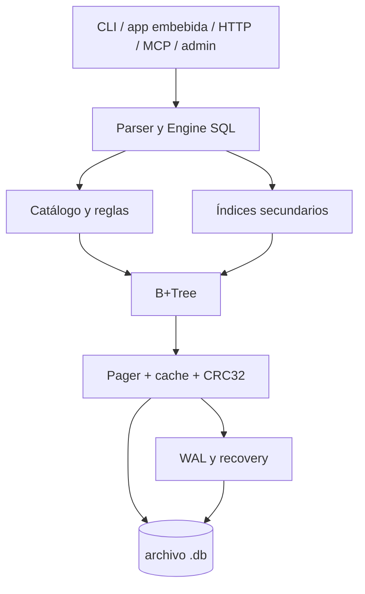
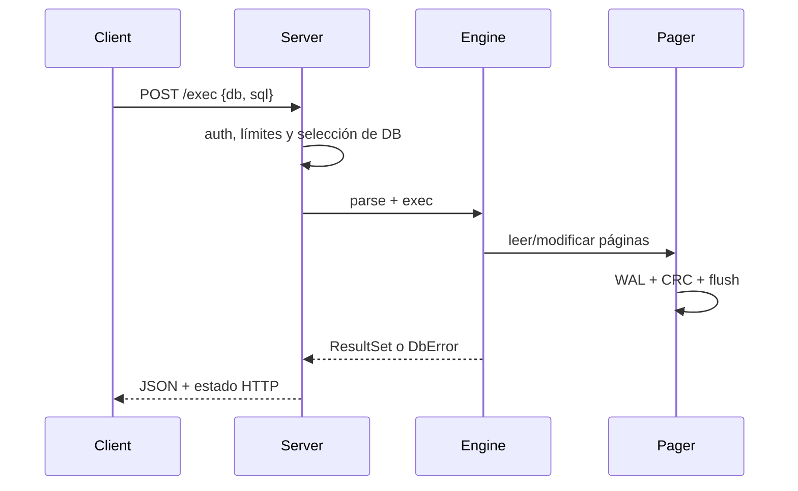
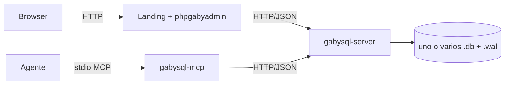

# 03. Arquitectura

gabysql usa una arquitectura por capas dentro de un crate: interfaces -> parser/engine -> catálogo e índices -> B+Tree -> pager/WAL -> archivo. El servidor añade concurrencia de conexiones, pero el acceso de escritura conserva el modelo single-writer.

`src/sql.rs` concentra AST, parser, evaluación y ejecución. `src/catalog.rs` serializa metadatos. `src/index.rs` codifica buckets hash e índices INT ordenados. `src/bptree.rs` implementa hojas, nodos internos y cursores. `src/storage.rs` controla páginas, cache, lock, WAL y recovery.

## Flujos de interfaz

El CLI omite la capa HTTP. El gateway MCP es un adaptador HTTP/JSON y no abre la base. `phpgabyadmin` actúa como proxy/controlador PHP; `gabymodeler` produce SQL en el navegador.

## Estado, errores y procesos

`Engine` conserva catálogo/estadísticas/sesión y puede recibir un `DbLogger`. El servidor mantiene métricas, locks y sesiones transaccionales con expiración pasiva. Los errores públicos usan `DbError` con prefijos `[GBY-NNNN]`. No se identificaron colas ni workers persistentes; la concurrencia HTTP usa threads.

## Despliegue

La descripción detallada y decisiones están en [ARCHITECTURE](../ARCHITECTURE.md) y [ADR](../adr/README.md).
