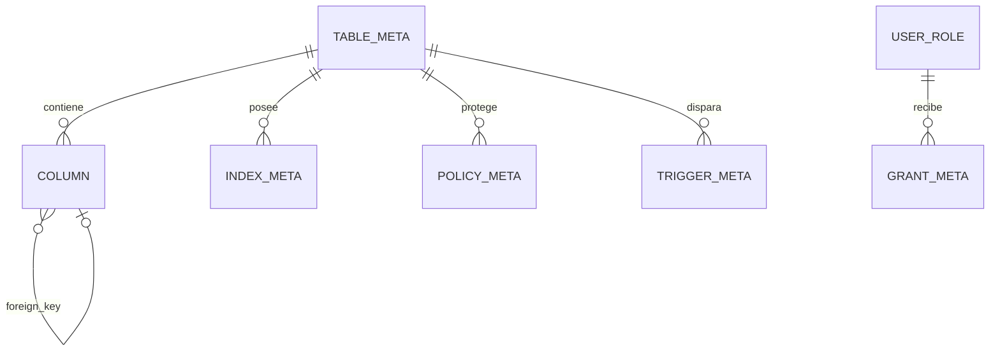

# 07. Persistencia y modelo de datos

gabysql no se conecta a un motor externo: **es** el motor. La persistencia reside en un archivo `.db`, acompañado temporalmente por `.wal`. No hay migraciones de aplicación ni esquema global fijo; cada usuario crea su catálogo mediante SQL.

## Modelo físico

| Estructura | Contenido | Integridad |
|---|---|---|
| Página 0 | Header, versión y referencias principales | Magic, versión y CRC |
| Páginas B+Tree | Nodos internos/hojas | Decodificación acotada y CRC |
| Árbol de catálogo | Tablas, vistas, índices, triggers, rutinas, usuarios, roles, grants, policies y stats | Codecs versionados |
| Árbol de tabla | PK INT o compuesta codificada -> fila | Constraints en engine |
| Árbol de índice | Hash/bucket o valor INT ordenado -> PKs | Mantenido con DML |
| WAL | Registros de páginas y marcador commit | CRC por registro y replay |

La especificación byte a byte está en [TECHNICAL_SPECS](../TECHNICAL_SPECS.md). No edite archivos manualmente.

## Diccionario de datos lógico

El esquema es dinámico. Los metadatos principales son:

| Entidad | Campos conceptuales | Relación |
|---|---|---|
| `TableMeta` | nombre, columnas, PK, raíz, checks | Posee filas e índices |
| `Column` | nombre, tipo, nullability, default, FK y parámetros | Pertenece a tabla |
| `IndexMeta` | nombre, tabla, columnas, raíz, kind, unique | Acelera/valida columnas |
| `ForeignKeyMeta` | columna(s), tabla/columna padre, acciones | Relaciona tablas |
| `ViewMeta` | nombre, SQL fuente y aliases | Deriva de consulta |
| `TriggerMeta` | nombre, evento, timing, tabla y body | Ejecuta con DML |
| `ProcedureMeta` / `FunctionMeta` | nombre, parámetros y body | Rutinas SQL |
| `UserMeta` / `RoleMeta` / `GrantMeta` | identidad, hash/rol/privilegios | Autorización |
| `PolicyMeta` | tabla, acción, roles, USING/WITH CHECK | RLS |
| `StatsMeta` / `ColumnStats` | filas, NDV, MCV, histogramas | Planner |

## Tipos e integridad

Se observan INT y anchos, TEXT/VARCHAR, BOOL, FLOAT, DATE/DATETIME/TIME, JSON, UUID, BLOB y DECIMAL exacto. El catálogo conserva NOT NULL, default, PK, UNIQUE, FK y CHECK. Transacciones, RLS y triggers complementan la integridad. La sintaxis exacta debe consultarse en [SQL_REFERENCE](../SQL_REFERENCE.md).

## Backup y evolución

Use `backup`, `restore` y `verify`; el origen debe estar cerrado por otros procesos. El formato no promete lectura universal de versiones viejas: consulte [COMPATIBILITY](../../COMPATIBILITY.md) y mantenga copias verificadas antes de actualizar.
