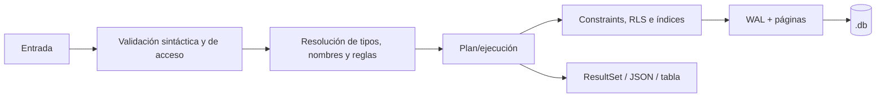

# 08. Flujo de datos

## Orígenes y destinos

| Origen | Validación/transformación | Destino |
|---|---|---|
| CLI/REPL | Argumentos -> parser SQL -> engine | Archivo y salida tabular |
| Cliente HTTP | Headers/body/auth/límites -> JSON -> SQL | Engine, JSON de respuesta |
| `phpgabyadmin` | Sesión, cookie, CSRF y allowlist de host | Server HTTP |
| `gabymodeler` | Modelo en navegador -> SQL | Descarga/copia o server según uso |
| Gateway MCP | JSON-RPC/schema/identificadores -> HTTP | Server; audit JSONL opcional |
| Librería Rust | AST o SQL -> métodos públicos | Pager del caller |

## Validación y transformación

El parser produce AST; el catálogo resuelve tipos/objetos; el engine evalúa expresiones y materializa valores/defaults; DML aplica constraints, privileges y policies. El row codec convierte `Value` a bytes y el B+Tree los ubica por clave. En lectura ocurre el flujo inverso antes de proyección/orden/límite.

## Riesgos de consistencia o pérdida

- Copiar un `.db` activo o separar un WAL pendiente puede producir un backup incoherente; use comandos soportados.
- Un formato incompatible se rechaza; no existe migración automática general documentada.
- Logs de statements/audit pueden fallar o rotar sin impedir necesariamente la escritura de datos; no son fuente de verdad transaccional.
- Sesiones HTTP abandonadas expiran y hacen rollback; el cliente debe conservar y cerrar su session ID.

## Datos sensibles

Las filas son definidas por el usuario y pueden contener datos personales. Tokens HTTP, hashes/salts de usuario, SQL completo, `reason` del agente y direcciones de cliente merecen protección. No se observó telemetría externa obligatoria del núcleo. Google Fonts recibe solicitudes del navegador al abrir el modelador salvo que se autoaloje/bloquee.
