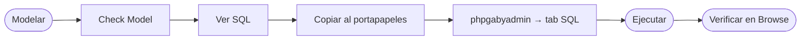
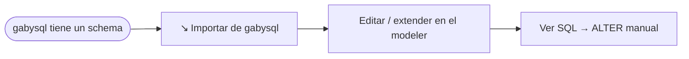

# 📐 gabymodeler v3

> **Modelador ER → DDL** para `gabysql`.
> Single-page HTML+CSS+JS vanilla, sin frameworks, sin servidor obligatorio.
> Persistencia local en `localStorage`. Espejo del motor `gabysql VERSION 33`.

**Cambios v3 vs v2** (sesión 2026-06-17 → 2026-06-18, pushes 2-16):
- 🎨 **Refresh visual** completo: paleta GitHub-style (#0a0e14/#58a6ff), Inter + JetBrains Mono, alineado con phpgabyadmin v2 y la landing.
- 📦 **Tipos extendidos** (Y1-Y9): `TINYINT/SMALLINT/MEDIUMINT/BIGINT` firmados y `UNSIGNED`, `DECIMAL(p,s)`, `VARCHAR(n)`, `CHAR(n)`, `DOUBLE`, `TIME`, `TIMESTAMP`, `BLOB`, `UUID`.
- 🔑 **PK** puede ser cualquier entero o `UUID` (antes forzaba `INT`).
- 🔗 **FK** auto-coerciona al tipo de la PK target.
- ✅ **CHK** flag: CHECK constraint inline por columna.
- 🔧 **Composite constraints**: PRIMARY KEY (a, b) y UNIQUE (a, b) table-level + CREATE INDEX multi-columna con picker de orden.
- 👁️ **Views**: CREATE VIEW name AS SELECT ... con validación nombre + colisión con tablas.
- 🔒 **RLS Policies**: CREATE POLICY ... FOR action [TO role] [USING] [WITH CHECK].
- ⚡ **Triggers**: BEFORE/AFTER × INSERT/UPDATE/DELETE con validación de NEW/OLD por evento.
- 🔁 **Procedures + Functions**: params multi-línea, returns dropdown para functions.
- 👥 **Security**: Users (con password opcional warning), Roles, Grants con picker de privilegios (SELECT/INSERT/UPDATE/DELETE/REFERENCES/TRUNCATE) chip multi-select.
- 🔍 **Canvas**: zoom-to-cursor (Ctrl+Wheel), pan middle-click/Alt, fit-all, atajos teclado +/−/0/F.
- 🗺️ **Minimap** navegable click-drag con viewport indicator.

---

## 🎯 Qué hace

1. **Modela** entidades (tablas) con sus columnas, tipos y constraints declarativas:
   - `PRIMARY KEY` (PK), `NOT NULL` (NN), `UNIQUE` (UN), `FOREIGN KEY` (FK con `ON DELETE`).
   - `DEFAULT <literal>` editable inline por columna.
2. **Check Model** continuo (14 reglas) con tabla de hallazgos navegable:
   - PK ausente / duplicada / no INT, columna duplicada, identificador inválido o reservado, NOT NULL+DEFAULT NULL, UNIQUE sobre JSON, FK rota o con type mismatch, etc.
3. **Exporta SQL** ordenado topológicamente (parents antes que children) con todas las constraints inline:
   - `CREATE DATABASE [IF NOT EXISTS] <name>;`
   - `CREATE TABLE <ent> (... PRIMARY KEY / NOT NULL / UNIQUE / DEFAULT / REFERENCES ... ON DELETE ...);` por cada entidad.
4. **Importa de gabysql**: dado URL del server (default `http://localhost:8080`) + token + nombre de DB, consume `GET /tables?db=<db>` y reconstruye entidades, columnas y FKs. Reverse engineering one-shot.
5. **Persiste** el trabajo en `localStorage` (`gabymodeler.v2`). Si encuentra un modelo viejo (`gabymodeler.v1`), lo migra al schema nuevo en el primer load.

---

## 🧭 Layout

```
+---- Header (toolbar): + Entidad · ↘ Importar · 📋 Ver SQL · 📦 Ejemplo · 🗑 ----+
+--------+-----------------------------------+
| Object |                                   |
| Browser|          Canvas                   |
| (DB,   |   [Entity boxes + FK lines SVG]   |
|  Tables|                                   |
|  Indexes)                                  |
|        |                                   |
+--------+----- Result List (collapsible) ---+
|        | [Check Model] [SQL Preview]      |
|        | severidad | objeto | detalle ...  |
+--------+-----------------------------------+
| Status: VERSION 33 · N tablas · 0 errores |
+-------------------------------------------+
```

- **Object Browser**: árbol jerárquico DB > Tables > [tabla] > columnas con badges (`PK`, `NN`, `UN`, `FK`); también lista los índices auto-derivados de columnas UNIQUE.
- **Canvas**: drag & drop de entidades. SVG para líneas FK (Bezier; `ON DELETE CASCADE` se dibuja sólida, `RESTRICT` punteada).
- **Result List**: dos tabs colapsables.
  - **Check Model**: cada hallazgo es clickeable y selecciona la entidad/columna en el canvas + browser.
  - **SQL Preview**: el DDL en vivo, sin abrir modal.
- **Status bar**: target VERSION + counts + indicador `0 errores · 0 warnings`.

---

## 🚀 Cómo levantarlo

### Opción A — Docker compose (recomendado)
```bash
docker compose up -d --build
# Modeler:       http://localhost:8000/modeler/
# phpgabyadmin:  http://localhost:8000/phpgabyadmin/
# API:           http://localhost:8080
```

### Opción B — `php -S` local
```bash
php -S localhost:8000 -t web
```

### Opción C — sin servidor PHP
El modeler es HTML estático puro:
```bash
python3 -m http.server 8000 --directory web
# http://localhost:8000/modeler/
```

> Para usar **Importar**, levantá también el server: `gabysql-server -dir ./data -addr :8080`. Desde gabysql VERSION 6 el server emite headers CORS, por lo que el modeler en `:8000` puede leer el API en `:8080` sin proxy.

---

## 🧭 Flujo de trabajo típico



Alternativa con reverse engineering:



---

## 🗂️ Tipos y constraints soportados

| Tipo | PK | UNIQUE | DEFAULT | FK |
| :--- | :---: | :---: | :---: | :---: |
| `INT` | ✅ | ✅ | ✅ | ✅ (tipo de toda FK) |
| `TEXT` | ❌ | ✅ | ✅ | ❌ |
| `BOOL` | ❌ | ✅ | ✅ | ❌ |
| `FLOAT` | ❌ | ✅ | ✅ | ❌ |
| `DATE` | ❌ | ✅ | ✅ | ❌ |
| `DATETIME` | ❌ | ✅ | ✅ | ❌ |
| `JSON` | ❌ | ⚠ rechazado por motor | ✅ | ❌ |

Notas:
- PK debe ser INT y es implícitamente NOT NULL.
- FK debe apuntar a la PK del parent (target column = PK del target).
- `ON DELETE`: `RESTRICT` (default) o `CASCADE`.

Ver [docs/SQL_REFERENCE.md](../../docs/SQL_REFERENCE.md) y [docs/TECHNICAL_SPECS.md](../../docs/TECHNICAL_SPECS.md) para el detalle del motor.

---

## ⚠️ Limitaciones conocidas

- No hay **DROP COLUMN** ni **RENAME TABLE/COLUMN** desde el modeler — las edita reemitiendo el `CREATE TABLE` completo. Para edición incremental usar `ALTER TABLE ADD COLUMN` directamente vía phpgabyadmin (el motor lo soporta desde VERSION 5).
- El reverse engineering (`↘ Importar`) **reemplaza** el modelo actual; no hace merge.
- Sin **undo/redo** todavía. `localStorage` mantiene el último estado guardado.
- Sin **auto-layout**: las entidades importadas se acomodan en una grilla 4-columnas.

---

## 🧱 Stack y filosofía

- HTML + CSS + JS vanilla. Cero deps. Cero `npm install`. Cero build step.
- SVG para FKs (Bezier con marker arrow + dasharray según `onDelete`).
- `localStorage` con clave `gabymodeler.v2`. Migración automática desde `gabymodeler.v1` (modelo viejo sin constraints).
- Diseño consistente con `phpgabyadmin` y la landing PHP (mismas paletas, tipografía Georgia, dark theme `#0d1117`).
- Las reglas de identificadores y palabras reservadas están **hardcoded** acá pero **espejean** las del motor (`catalog::validate_identifier`, `catalog::RESERVED_WORDS`); cualquier cambio en el motor pide actualización en el modeler.
