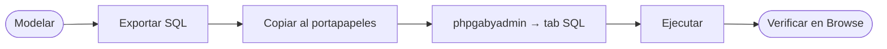

# 📐 gabymodeler

> **Modelador ER → DDL** para `gabysql`. Single-page HTML+CSS+JS vanilla, sin frameworks, sin servidor. Persistencia local en `localStorage`. Pensado como acompañante de [phpgabyadmin](../phpgabyadmin/).

---

## 🎯 Qué hace

1. **Modela** entidades (tablas) con sus columnas, tipos y flags (`PK`, `idx`).
2. **Exporta** el modelo como SQL DDL listo para `gabysql`:
   - `CREATE DATABASE [IF NOT EXISTS] <name>;`
   - `CREATE TABLE <ent> (...);` por cada entidad
   - `CREATE INDEX idx_<ent>_<col> ON <ent> (<col>);` por cada columna marcada como `idx`
3. **Persiste** el trabajo en `localStorage` de tu navegador (no necesita backend).
4. **Probar en phpgabyadmin** — link directo al admin web; pegas el SQL en el tab SQL y se ejecuta dentro de la misma transacción.

---

## 🚀 Cómo levantarlo

### Opción A — Docker compose (recomendado)
```bash
docker compose up -d --build
# Modeler:       http://localhost:8000/modeler/
# phpgabyadmin:  http://localhost:8000/phpgabyadmin/
# API:           http://localhost:8080
```

### Opción B — `php -S` local
```bash
php -S localhost:8000 -t web
# Mismas URLs que arriba.
```

### Opción C — sin servidor PHP
El modeler es HTML estático puro. Cualquier servidor de archivos sirve:
```bash
python3 -m http.server 8000 --directory web
# http://localhost:8000/modeler/
```

---

## 🧭 Flujo de trabajo típico



1. Click en `＋ Nueva entidad`.
2. Define columnas, marca `PK` (debe ser `INT`) y `idx` donde quieras un índice secundario.
3. (Opcional) Click `↪ FK` para agregar una columna que apunte a otra entidad — el modeler la documenta como comentario en el SQL (las FOREIGN KEYS declarativas no están implementadas en gabysql `VERSION 4` todavía).
4. Click `Exportar SQL` → copia o descarga el `.sql`.
5. Abre [phpgabyadmin](../phpgabyadmin/), pestaña SQL, pega y ejecuta.

---

## 🗂️ Tipos soportados

| Tipo | Indexable | Notas |
| :--- | :---: | :--- |
| `INT` | ✅ | Único tipo válido como PK |
| `TEXT` | ✅ | Hasta 65 535 bytes |
| `BOOL` | ✅ | `TRUE` / `FALSE` |
| `FLOAT` | ✅ | `f64` |
| `DATE` | ✅ | Texto ISO-8601 |
| `DATETIME` | ✅ | Texto ISO-8601 |
| `JSON` | ❌ | Sin semántica de igualdad canónica |

Para detalles, [docs/SQL_REFERENCE.md](../../docs/SQL_REFERENCE.md).

---

## 🧪 SQL ejemplo (botón "Cargar ejemplo")

```sql
-- Generado por gabymodeler · 2026-...
CREATE DATABASE IF NOT EXISTS shop;

CREATE TABLE users (
  id INT PRIMARY KEY,
  email TEXT,
  name TEXT
);
CREATE INDEX idx_users_email ON users (email);

CREATE TABLE orders (
  id INT PRIMARY KEY,
  customer_id INT,
  status TEXT,
  total FLOAT
);
CREATE INDEX idx_orders_customer_id ON orders (customer_id);
CREATE INDEX idx_orders_status ON orders (status);

-- FOREIGN KEYS (informativas, no implementadas en gabysql v0.1.x):
-- FK: orders.customer_id -> users.id (no enforced en VERSION 4)
```

---

## ⚠️ Limitaciones conocidas

- Las **FOREIGN KEYS** se documentan como comentarios — no son enforced por el motor en `VERSION 4`.
- El modeler **no se conecta** a la API HTTP automáticamente: copias/pegas el SQL en `phpgabyadmin`. Esto es deliberado (modeler 100% estático, sin coupling con CORS / token).
- No hay **importar** desde un `.db` existente; eso requeriría un endpoint de introspección + parser. Está en el ROADMAP del Camino A.
- Sin **soporte de undo/redo** todavía. `localStorage` mantiene el último estado guardado; usar `Limpiar` es destructivo.

---

## 🧱 Stack y filosofía

- HTML + CSS + JS vanilla. Cero deps. Cero `npm install`.
- SVG para las relaciones FK (líneas Bezier).
- `localStorage` con clave `gabymodeler.v1`.
- Diseño consistente con `phpgabyadmin` y la landing PHP (mismas paletas, tipografía Georgia).
