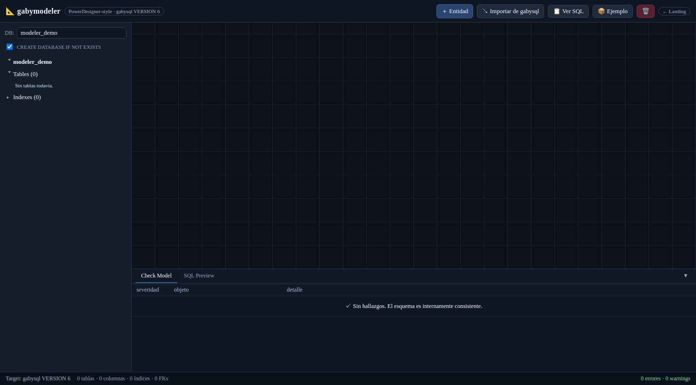
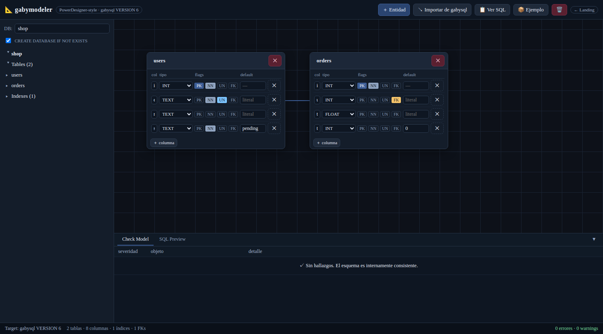
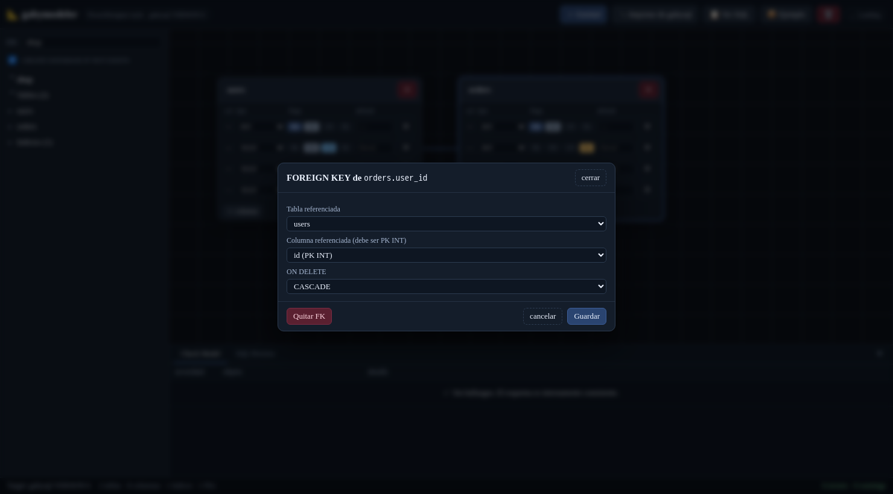
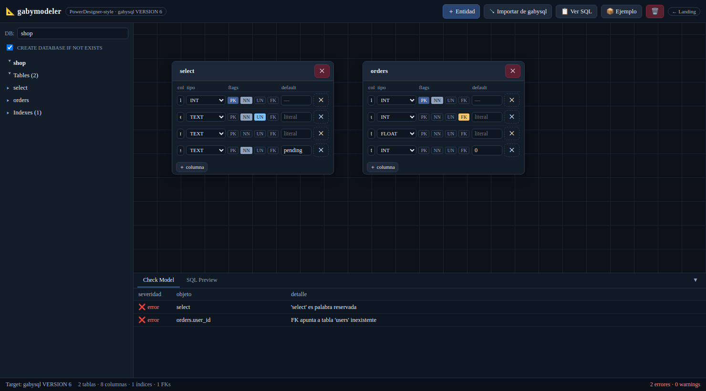
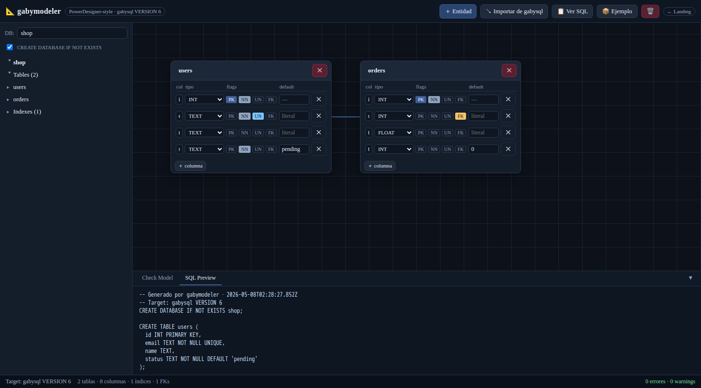
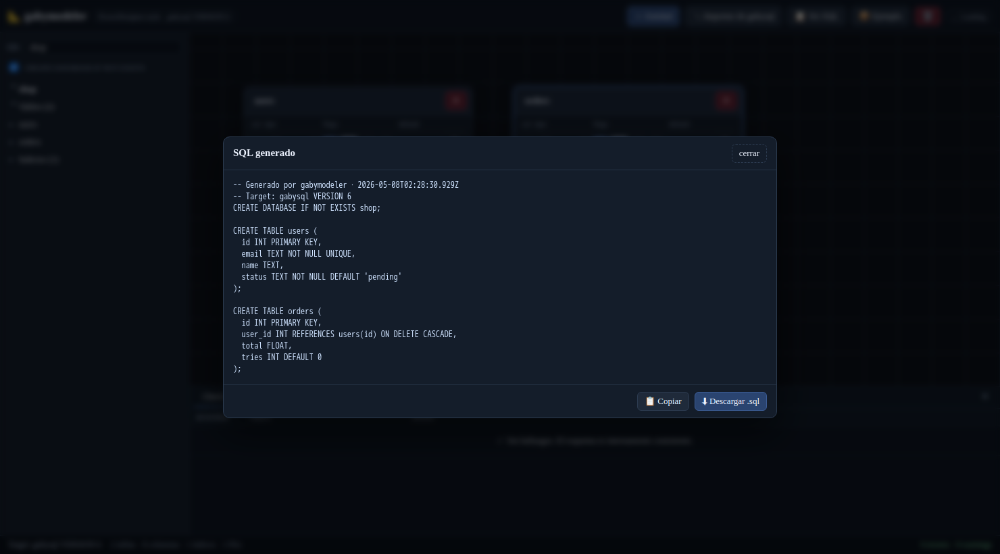
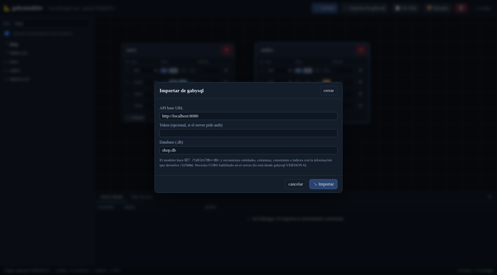

# 📖 Manual de usuario · gabymodeler v2

> **Modelador ER → DDL** para `gabysql`. Layout PowerDesigner-style. Single-page HTML+CSS+JS vanilla, sin frameworks ni servidor obligatorio. Espejo del motor `gabysql VERSION 8`.
>
> Este manual te lleva de cero a un schema completo (con constraints, índices y FOREIGN KEYs) listo para ejecutar en `gabysql`. Cada paso tiene su captura.

---

## 🧭 Tabla de contenidos

1. [Cómo levantarlo](#1-cómo-levantarlo)
2. [Anatomía de la pantalla](#2-anatomía-de-la-pantalla)
3. [Crear tu primera tabla](#3-crear-tu-primera-tabla)
4. [Constraints por columna (PK · NN · UN · DEFAULT · FK)](#4-constraints-por-columna-pk--nn--un--default--fk)
5. [Editar una FOREIGN KEY](#5-editar-una-foreign-key)
6. [Check Model — el corazón "resolver problemas"](#6-check-model--el-corazón-resolver-problemas)
7. [Ver / exportar el SQL](#7-ver--exportar-el-sql)
8. [Importar de gabysql (reverse engineering)](#8-importar-de-gabysql-reverse-engineering)
9. [Persistencia y atajos](#9-persistencia-y-atajos)
10. [Limitaciones conocidas](#10-limitaciones-conocidas)

---

## 1. Cómo levantarlo

El modeler es **HTML estático puro**. Lo podés servir desde cualquier servidor de archivos.

### Opción A — Docker compose (recomendado)
```bash
docker compose up -d --build
# Modeler:       http://localhost:8000/modeler/
# phpgabyadmin:  http://localhost:8000/phpgabyadmin/
# API gabysql:   http://localhost:8080
```

### Opción B — `php -S` local
```bash
php -S localhost:8000 -t web
```

### Opción C — sin servidor PHP
```bash
python3 -m http.server 8000 --directory web
# http://localhost:8000/modeler/
```

> Para usar **↘ Importar de gabysql** necesitás también el server real. Levantalo con:
> ```bash
> gabysql-server -dir ./data -addr :8080
> ```
> Desde `gabysql VERSION 8` el server ya emite headers CORS, así que el modeler en `:8000` puede hablarle al API en `:8080` sin proxy.

---

## 2. Anatomía de la pantalla

Cuando abrís el modeler por primera vez ves esto:



Las cinco regiones:

| # | Región | Para qué sirve |
| :--- | :--- | :--- |
| **Header** | Toolbar superior | `＋ Entidad`, `↘ Importar de gabysql`, `📋 Ver SQL`, `📦 Ejemplo`, 🗑 (limpiar), `← Landing`. |
| **Object Browser** (izq) | Árbol jerárquico DB > Tables > columnas con badges + sección Indexes. Click navega/selecciona. |
| **Canvas** (centro) | Grid donde se sueltan las entidades. SVG dibuja las líneas FK Bezier. |
| **Result List** (abajo) | Dos pestañas colapsables: **Check Model** (validación) y **SQL Preview** (DDL en vivo). |
| **Status bar** | Target del motor, contadores (tablas / columnas / índices / FKs), indicador `N errores · M warnings` en color. |

> El input **DB** y el checkbox **CREATE DATABASE IF NOT EXISTS** controlan el `CREATE DATABASE` que va al inicio del SQL emitido.

---

## 3. Crear tu primera tabla

Tres caminos:

### A. Click en **＋ Entidad**
Crea una tabla `tablaN` con una sola columna `id INT PRIMARY KEY`. Renómbrala desde el header de la card; los nombres se sanitizan automáticamente a `[A-Za-z0-9_]`.

### B. Click en **📦 Ejemplo**
Carga el modelo `shop` con `users` + `orders` y FK CASCADE. Útil para arrancar y modificar:



A la izquierda el árbol muestra `shop > Tables (2)` con `users` y `orders` + `Indexes (1)` con el `uq_users_email` derivado del UNIQUE inline. La línea entre ambas cards es la FK `orders.user_id → users.id`.

### C. **↘ Importar de gabysql**
Reverse-engineering desde una DB existente. Ver [§8](#8-importar-de-gabysql-reverse-engineering).

---

## 4. Constraints por columna (PK · NN · UN · DEFAULT · FK)

Cada fila de columna en una entidad expone:

```
[nombre]   [tipo ▼]   [PK NN UN FK]   [default]   [✕]
```

| Flag | Significado | Notas |
| :---: | :--- | :--- |
| **PK** | `PRIMARY KEY` | Una sola PK por tabla. Marcarla fuerza `INT` y `NOT NULL`. La PK no admite DEFAULT. |
| **NN** | `NOT NULL` | Bloqueado en la PK (ya es NOT NULL implícito). Si la columna también tiene DEFAULT NULL es contradictorio y Check Model lo marca. |
| **UN** | `UNIQUE` | Auto-genera un índice unique con nombre `uq_<tabla>_<col>`. Múltiples NULL son válidos (consistente con SQL estándar). |
| **FK** | `FOREIGN KEY` | Abre un mini-modal — ver [§5](#5-editar-una-foreign-key). |

El input **default** acepta literales:

| Tipo | Literal aceptado | Ejemplo SQL |
| :--- | :--- | :--- |
| `INT` | enteros | `DEFAULT 0` |
| `FLOAT` | enteros / decimales | `DEFAULT 0.0` |
| `BOOL` | `true` / `false` | `DEFAULT TRUE` |
| `TEXT` / `DATE` / `DATETIME` / `JSON` | cualquier string | `DEFAULT 'pending'` (se quotea automáticamente) |
| cualquiera | `NULL` (literal) | `DEFAULT NULL` |

**Vacío = sin DEFAULT.** Si querés `DEFAULT NULL` explícito, escribí `NULL`.

---

## 5. Editar una FOREIGN KEY

Click en el flag **FK** de cualquier columna abre el mini-modal:



Tres campos:

- **Tabla referenciada**: el dropdown lista todas las tablas del modelo, incluida la propia (self-reference como `employee.manager_id → employee.id`).
- **Columna referenciada (debe ser PK INT)**: filtra al solo PKs del target. El motor gabysql solo admite FKs contra la PK del parent (single-column INT). `ON DELETE SET NULL`/`SET DEFAULT` y `ON UPDATE …` quedan en backlog (ver [docs/MISSING_COMMANDS.md](../../docs/MISSING_COMMANDS.md)).
- **ON DELETE**: `RESTRICT` (default) refusa el DELETE del parent si hay hijos; `CASCADE` borra los hijos.

Tres acciones:

- **Quitar FK**: descarta la FK actual.
- **cancelar**: cierra sin tocar.
- **Guardar**: persiste y dibuja la línea en el canvas.

**Notación visual** en el canvas:
- Línea **sólida** con flecha → `ON DELETE CASCADE`.
- Línea **punteada** con flecha → `ON DELETE RESTRICT`.

El tipo de la columna FK se fuerza a `INT` automáticamente porque la PK del target es siempre `INT` en esta versión del motor.

---

## 6. Check Model — el corazón "resolver problemas"

La pestaña **Check Model** corre **continuamente** sobre el modelo y lista cada inconsistencia. Cuando todo está sano:

```
✓ Sin hallazgos. El esquema es internamente consistente.
```

Cuando rompés algo, los hallazgos aparecen como filas. Por ejemplo, renombrá `users` → `select` (palabra reservada del parser) y mirá lo que pasa:



Dos errores en cascade:

| severidad | objeto | detalle |
| :--- | :--- | :--- |
| ❌ error | `select` | `'select' es palabra reservada` |
| ❌ error | `orders.user_id` | `FK apunta a tabla 'users' inexistente` |

Y el status bar pasa a `2 errores · 0 warnings` en rojo. Cada fila es **clickeable** y selecciona la entidad/columna afectada en el canvas y el browser para que la corrijas en un click.

### Las 14 reglas que evalúa

| # | Regla | Severidad |
| :---: | :--- | :---: |
| 1 | Tabla sin PRIMARY KEY | error |
| 2 | Tabla con > 1 PRIMARY KEY (esta versión soporta una sola) | error |
| 3 | PK con tipo distinto de `INT` | error |
| 4 | Tabla sin nombre o sin columnas además de la PK | error / warn |
| 5 | Identificador (tabla / columna) inválido (no matchea `[A-Za-z_][A-Za-z0-9_]*`) | error |
| 6 | Identificador que excede 64 chars | error |
| 7 | Identificador que es palabra reservada del parser | error |
| 8 | Nombre de tabla o columna duplicado | error |
| 9 | `NOT NULL` con `DEFAULT NULL` (contradictorio) | error |
| 10 | `DEFAULT` declarado sobre la PK (no permitido) | error |
| 11 | DEFAULT con literal incompatible con el tipo declarado | error |
| 12 | Índice `UNIQUE` sobre tipo `JSON` (rechazado por el motor) | warning |
| 13 | FK que apunta a una tabla inexistente | error |
| 14 | FK que apunta a una columna que no es la PK del target o con tipo distinto | error |

Las reglas son un **espejo** de las que el motor (`catalog::validate_identifier`, `validate_create_table`, `validate_fk_targets`) aplicaría al ejecutar el `CREATE TABLE`. Si Check Model está limpio, el SQL emitido se ejecuta sin sorpresas.

---

## 7. Ver / exportar el SQL

Tenés dos formas de revisar el SQL final:

### A. Tab **SQL Preview** (en vivo)
Mientras editás, el DDL se regenera al instante en el panel inferior:



### B. Botón **📋 Ver SQL** (modal)
Abre el SQL completo en un modal con scroll, listo para copiar/descargar:



- **📋 Copiar**: copia al portapapeles.
- **⬇ Descargar .sql**: descarga `<dbName>.sql`.

### Garantías del SQL emitido

1. **Orden topológico**: las tablas referenciadas (parents) se emiten antes que las que las referencian (children). Pegar el SQL en una sola transacción (batch HTTP auto-commit, o envolviéndolo en `BEGIN; ... COMMIT;` explícito desde el bloque T del 2026-05-25) siempre funciona.
2. **Constraints inline**: `PRIMARY KEY`, `NOT NULL`, `UNIQUE`, `DEFAULT <literal>`, `REFERENCES <tabla>(<col>) [ON DELETE ...]` van todas dentro del `CREATE TABLE`.
3. **Quoting tipado**: los DEFAULTs se quotean según el tipo (`'pending'` para TEXT, `0` para INT, `TRUE` para BOOL).
4. **Header informativo**: las dos primeras líneas son comentarios con el timestamp y el target (`gabysql VERSION 8`).

Pegalo en `phpgabyadmin → SQL`, o mandalo al endpoint `/exec` con un POST JSON.

---

## 8. Importar de gabysql (reverse engineering)

Si ya tenés una DB en gabysql, no hace falta volver a modelar el schema desde cero. Click en **↘ Importar de gabysql**:



Tres campos:

| Campo | Default | Comentario |
| :--- | :--- | :--- |
| **API base URL** | `http://localhost:8080` | El endpoint del `gabysql-server`. Desde gabysql VERSION 8 ya tiene CORS habilitado. |
| **Token** | (vacío) | Solo si el server fue iniciado con `-token <secret>`. Va como `Authorization: Bearer <token>`. |
| **Database (.db)** | `<dbName actual>.db` | Nombre exacto del archivo DB. |

Click en **↘ Importar**:

1. El modeler hace `GET /tables?db=<db>` con CORS habilitado.
2. El server responde con el schema completo (constraints, índices, FKs) — la respuesta enriquecida que documenta [docs/API.md](../../docs/API.md#get-schemadbdemodbtableusers).
3. El modeler **reemplaza** el modelo actual y reconstruye entidades, columnas, constraints y FKs. Las entidades se acomodan en una grilla 4-columnas.
4. Toast verde de confirmación: `Importadas N tablas de <db>.`

> ⚠️ **Reemplaza, no hace merge.** Si tenías un modelo en progreso, guardalo (descargá su SQL primero) antes de importar.

El round-trip **schema → server → import → emit** es **lossless**: el SQL regenerado por el modeler matchea byte por byte el `CREATE TABLE` que originalmente creó esas tablas.

---

## 9. Persistencia y atajos

- **localStorage** (`gabymodeler.v2`): cada cambio se guarda automáticamente en tu navegador. Cerrar la pestaña no pierde el modelo.
- **Migración v1 → v2 automática**: si veníamos de la versión vieja del modeler (`gabymodeler.v1`), se traduce al schema nuevo en el primer load (los flags NN/UN/DEFAULT/FK quedan en blanco; los completás a mano).
- **🗑 botón rojo** en el header: borra el modelo actual y limpia localStorage. Pide confirmación.
- **📦 Ejemplo**: reemplaza el modelo actual por el schema `shop` (sirve para resetear).
- **Drag & drop**: arrastrá las entidades por su header para acomodarlas; las posiciones se persisten.
- **Result List colapsable**: el ▼/▲ a la derecha del tab bar oculta la zona inferior para tener más canvas.

---

## 10. Limitaciones conocidas

- Sin **DROP COLUMN** ni **RENAME TABLE/COLUMN** desde el UI — para edición incremental usá `ALTER TABLE ADD COLUMN` en `phpgabyadmin` (el motor lo soporta desde `gabysql VERSION 5`).
- Importar **reemplaza** el modelo, no hace merge.
- Sin **undo/redo**. `localStorage` mantiene el último estado guardado; usá 🗑 con cuidado.
- Sin **auto-layout**: las entidades importadas vienen en una grilla simple; reacomodalas a mano.
- Las FKs solo apuntan a la **PK del parent** (limitación actual del motor, no del modeler).
- Solo `ON DELETE RESTRICT` y `CASCADE`. `SET NULL`/`SET DEFAULT`/`NO ACTION` no están soportados.

Para el detalle de la gramática SQL completa que entiende el motor: [docs/SQL_REFERENCE.md](../../docs/SQL_REFERENCE.md).
Para el contrato JSON de los endpoints `/tables` y `/schema`: [docs/API.md](../../docs/API.md).
