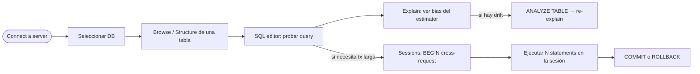
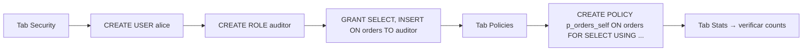

# 🛠 phpgabyadmin v2

> **Admin web single-file** para `gabysql`, escrito en PHP puro
> (sin frameworks, sin dependencias Composer). Sirve la UI sobre
> el server HTTP `gabysql-server`.
>
> Refresh visual + funcional 2026-06-17/18 — paleta GitHub-style,
> Inter + JetBrains Mono, alineado con la landing y con `gabymodeler v3`.

---

## 🎯 Qué hace

UI completa de gestión de un `gabysql-server`. **9 tabs**:

| Tab | Para qué sirve | Endpoint motor |
|---|---|---|
| **Browse** | Explorar datos de una tabla con paginado + export CSV | `/rows` |
| **Structure** | Columnas + índices CRUD inline + CHECK + FKs | `/schema` |
| **SQL editor** | Editor con CodeMirror, snippets, Ctrl+Enter ejecuta | `/exec` |
| **Sessions** | Abrir/cerrar transacciones cross-request HTTP | `/tx/begin /tx/commit /tx/rollback` (M13) |
| **Explain** | `EXPLAIN ANALYZE` con bias coloreado GOOD/MILD/HIGH | `/exec` (M6) |
| **Stats** | KPIs (DBs/tablas/cols/idx/FKs/CHECK/PKs) + breakdown + dump `/metrics` + listado de Views + resumen Policies | `/tables /views /policies /metrics` |
| **Policies (RLS)** | Crear/eliminar CREATE POLICY con USING + WITH CHECK guiado | `/policies` (Z3) |
| **Routines** | Listado read-only de triggers + procedures + functions con body SQL colapsable | `/triggers /procedures /functions` (X1+X3) |
| **Security** | Users + Roles + Grants con picker de privilegios | `/users /roles /grants` (Z1+Z2) |

---

## 🔒 Seguridad

- **CSRF tokens**: cada form usa `csrf_field()` con un token regenerado
  por sesión PHP.
- **Cookie de autenticación**: HMAC-SHA256 sobre el token del server
  (no se guarda el token en claro).
- **Remote-allow guard**: el admin sólo acepta conexiones desde
  `localhost` por default. Para apuntar a un server remoto hay que
  exportar `GABYADMIN_ALLOW_REMOTE=1`.
- **`/users` blindado en el server**: el material secreto
  (`password_hash`, `salt`) NUNCA se serializa. Verificado por
  `tests/server_listing_endpoints.rs`.
- **Validación de identifiers**: todo input que termina como SQL pasa
  por `preg_match('/^[A-Za-z_][A-Za-z0-9_]*$/', $x)` antes de
  componer el statement. Privilegios validados contra whitelist.
- **Passwords en el form de usuario**: viajan en plano hasta el server,
  que los hashea con scrypt (default actual del motor — verificado
  por E2E). En producción usá HTTPS. La UI muestra warning visible.

---

## 🚀 Cómo levantarlo

### Opción A — Docker compose (recomendado)
```bash
docker compose up -d --build
# Admin:        http://localhost:8000/phpgabyadmin/
# Modeler:      http://localhost:8000/modeler/
# Landing:      http://localhost:8000/
# Server API:   http://localhost:8080
```

### Opción B — PHP local + server Rust
```bash
# Terminal 1 — server
cargo run --release --bin gabysql-server -- -dir ./data -addr :8080

# Terminal 2 — admin
php -S localhost:8000 -t web
# → http://localhost:8000/phpgabyadmin/
```

Requisitos PHP:
- PHP ≥ 7.4 (usa arrow functions del Push 11).
- Sesiones habilitadas (default).
- `curl` o `file_get_contents` con HTTPS (para hablar con el server).

### Variables de entorno

| Var | Default | Para qué |
|---|---|---|
| `GABYADMIN_SERVER` | `http://localhost:8080` | URL del `gabysql-server` |
| `GABYADMIN_ALLOW_REMOTE` | `0` | Si vale `1`, permite apuntar a server no-local |
| `GABYADMIN_TOKEN` | `""` | Bearer token si el server requiere auth |

---

## 🧭 Flujo típico



Para gestión:



---

## ⚙ Stack técnico

- **Single-file PHP** (~1900 LOC al 2026-06-18). Sin Composer, sin
  frameworks. Una sesión PHP nativa para el flash de toasts y para
  guardar el session ID de M13.
- **CodeMirror 5.65.16** vía cdnjs en los textareas SQL (editor SQL
  principal + USING + WITH CHECK del form de policies). Atajos:
  `Ctrl/Cmd+Enter` ejecuta, `Ctrl/Cmd+/` comenta.
- **Google Fonts** Inter + JetBrains Mono vía CDN. Si el navegador
  está offline el UI cae a `system-ui` / `ui-monospace` sin romper.
- **Sin JavaScript propio** salvo el auto-dismiss de toasts (5s).
  Toda la lógica de tabs es query-string + condicionales PHP.

---

## 📂 Archivos

```
web/phpgabyadmin/
├── README.md       este archivo
└── index.php       single-file: CSS + PHP handlers + HTML + JS
```

---

## 🔗 Relacionado

- [`web/modeler/`](../modeler/) — modelador ER `gabymodeler v3`,
  paleta unificada.
- [`docs/STATUS.md`](../../docs/STATUS.md) — tabla de features del motor.
- [`docs/adr/0091-catalog-listing-endpoints.md`](../../docs/adr/0091-catalog-listing-endpoints.md) —
  decisiones de los endpoints que consume el admin.
- [`docs/adr/0092-products-refresh-modeler-v3-admin-v2.md`](../../docs/adr/0092-products-refresh-modeler-v3-admin-v2.md) —
  contexto del refresh integral 2026-06-17/18.
